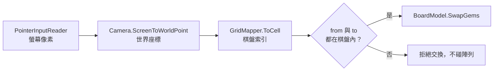
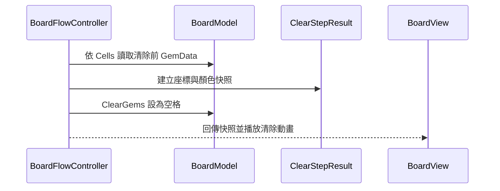
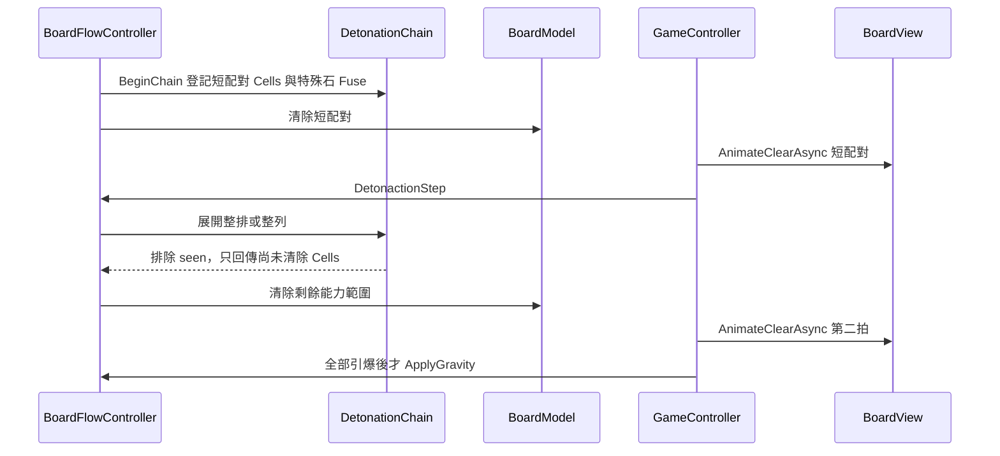

# MatchGems 現場課堂修正補充講稿

> 文件定位：本文件只服務 `CodingCatz/MatchGems` 現場教學 Repo 的除錯與補課。  
> 它不是原課程教材、不是 Lesson 01–20 的替代品，也不要求其他課程跟著同步。  
> 比對基準：`main` commit `774f1266e6ba39b7dda051cfbec83c7383735d7f`。  
> 驗證狀態：程式問題已完成靜態定位；Unity `6000.4.7f1` 的編譯與 Play Mode 行為仍待現場實機驗證。

## 這份補充課怎麼使用

這不是一次把所有程式換掉的修補清單，而是三段各約 45 分鐘的除錯課。每段維持同一個節奏：

1. 先用固定條件重現症狀。
2. 請學員預測資料應該怎麼流動。
3. 沿呼叫鏈找出第一個違反預期的位置。
4. 只修一個原因，立即重跑。
5. 留下可再次執行的回歸檢查。

每修完一項就建立一個小 commit。不要一次貼入整份終版程式，否則學員只會得到「新程式能跑」，卻不知道舊程式為什麼錯。

## 問題總覽與修正順序

| 順序 | 等級 | 問題 | 可觀察症狀 | 主要檔案 |
|---:|---|---|---|---|
| 1 | P1 | 世界座標轉格子時括號位置錯誤 | 格子尺寸不是 1 時，點擊與顯示對不上 | `GridMapper.cs` |
| 2 | P1 | 拖曳門檻混用世界單位與螢幕像素 | 滑鼠稍微移動就被當成拖曳 | `BoardInput.cs` |
| 3 | P1 | 第二次點擊使用舊的 `_targetCoord` | Click → Click 交換到 `(0,0)` 或上次拖曳位置 | `BoardInput.cs` |
| 4 | P1 | 交換只驗證 `to`，沒有驗證 `from` | 從棋盤外拖入時可能陣列越界 | `BoardFlowController.cs` |
| 5 | P1 | 初盤使用完全隨機填充 | 開局已有三消，無效交換也可能被接受 | `FillService.cs` |
| 6 | P1 | 清除後才讀取顏色 | `ClearedGemTypes` 永遠拿不到已清除寶石 | `BoardFlowController.cs` |
| 7 | P1 | 炸彈沒有驗證兩線真的相交 | 分離的橫線與直線也可能生出炸彈 | `BoardFlowController.cs` |
| 8 | P1 | 特殊線選擇被後面的短線覆蓋 | 五連可能輸給四連，與註解優先序不同 | `BoardFlowController.cs` |
| 9 | P2 | 同方向直線石看起來分兩次消除 | 先消短線，再消同一排／列剩餘寶石 | Controller／View 時序 |
| 10 | P2 | 有洞時 `MatchFinder` 直接讀起點顏色 | 若在未補滿的棋盤掃描，可能讀到空格 | `MatchFinder.cs` |
| 11 | P2 | Pool 重設時只套用普通色 | 特殊石經物件池重用後可能失去特殊外觀 | `GemTile.cs` |
| 12 | P2 | 非同步流程沒有 `try/finally` 保底 | 動畫丟例外後可能永遠維持 Busy | `MatchGemsGameController.cs` |

---

## 第一段：輸入座標不是同一種單位（約 45 分鐘）

### 本段目標

- 分清楚螢幕座標、世界座標與棋盤座標。
- 修正 `GridMapper.ToCell` 的運算順序。
- 讓 Click → Click 與 Drag 使用各自正確的目標座標。
- 在資料交換前封住棋盤外座標。

### 深層機制：座標轉換要維持單位一致

- **觸發時機**：玩家按下與放開滑鼠時，`BoardInput` 取得螢幕像素位置。
- **責任與接線**：Camera 把像素轉成世界位置；`GridMapper` 再把世界位置轉成 `CellCoord`；Flow 最後才驗證並交換資料。
- **資料與狀態流向**：Screen pixel → World unit → Cell index → `BoardModel` 陣列索引。
- **接錯症狀**：像素門檻拿世界尺寸比較會讓拖曳過度敏感；漏除格子尺寸會讓畫面位置與資料索引分離。
- **本段如何驗證**：分別使用 `CellWorldSize = 0.5 / 1 / 2` 點擊同一顆寶石，三種尺寸都必須得到正確格子。



### 修正 1：`GridMapper.ToCell` 的括號與負座標

**目前症狀**

```csharp
int x = (int)(local.x + _cellWorldSize * 0.5f / _cellWorldSize);
```

乘除先於加法，實際計算接近 `local.x + 0.5f`，`_cellWorldSize` 沒有拿來縮放 `local.x`。此外，`(int)` 對負數朝零截斷，棋盤左下邊界容易被誤判到第 0 格。

**修正落點**

檔案：`Assets/Scripts/Core/GridMapper.cs`  
方法：`ToCell(Vector3 worldPos)`  
呼叫端：`BoardInput.ScreenToCell`

```csharp
public CellCoord ToCell(Vector3 worldPos)
{
    Vector3 local = worldPos - _origin;
    int x = Mathf.FloorToInt(
        (local.x + _cellWorldSize * 0.5f) / _cellWorldSize);
    int y = Mathf.FloorToInt(
        (local.y + _cellWorldSize * 0.5f) / _cellWorldSize);
    return new CellCoord(x, y);
}
```

**立即驗證**

- 將 CellWorldSize 改成 `2`，點第 `(3,2)` 格，Log 必須仍是 `(3,2)`。
- 點棋盤左邊界外一點，X 必須是負數，不能被截成 `0`。

### 修正 2：拖曳門檻統一使用螢幕像素

**目前症狀**

`_dragDelta` 來自兩個螢幕座標相減，單位是 pixel；`_dragThreshold = cellSize * 0.6f` 卻是世界尺寸。預設門檻約為 `0.6`，滑鼠移動一個像素就足以進入拖曳分支。

**修正落點**

檔案：`Assets/Scripts/Input/BoardInput.cs`  
欄位與方法：`_dragThreshold`、`Configure`

```csharp
[SerializeField, Min(1f)]
private float _dragThreshold = 32f;

public void Configure(GridMapper gridMapper)
{
    _gridMapper = gridMapper;
    if (_camera == null) _camera = Camera.main;
}
```

這裡的 `32f` 是像素門檻。若未來要依解析度或 DPI 調整，應在輸入層統一換算，不能再次拿世界格尺寸直接比較。

**立即驗證**

- 按下後移動 5px 再放開：仍算點擊。
- 明顯往右拖超過 32px：只要求交換右邊相鄰格。

### 修正 3：Click → Click 要使用第二次點到的格子

**目前症狀**

第二次點擊呼叫 `_selectedCoord → _targetCoord`，但 `_targetCoord` 只在拖曳分支更新，所以它可能是預設 `(0,0)` 或上次拖曳留下的值。

**修正落點**

檔案：`Assets/Scripts/Input/BoardInput.cs`  
方法：`EndPointer`、`SelectOrSwap`

```csharp
private void EndPointer(Vector2 upPos)
{
    _isDragging = false;
    _dragDelta = upPos - _dragStartPos;

    if (_dragDelta.magnitude >= _dragThreshold)
    {
        CellCoord targetCoord = GetTargetCoord();
        SwapAction?.Invoke(_dragStartCoord, targetCoord);
        return;
    }

    CellCoord clickedCoord = ScreenToCell(upPos);
    SelectOrSwap(clickedCoord);
}

private void SelectOrSwap(CellCoord clickedCoord)
{
    if (!_hasSelected)
    {
        _hasSelected = true;
        _selectedCoord = clickedCoord;
        return;
    }

    _hasSelected = false;
    SwapAction?.Invoke(_selectedCoord, clickedCoord);
}
```

**立即驗證**

- 先點 `(2,2)`，再點 `(3,2)`，事件參數必須正好是這兩格。
- 做過一次拖曳後再使用兩次點擊，結果不能受上一次拖曳影響。

### 修正 4：交換前同時驗證 `from` 與 `to`

**目前症狀**

`TrySwap` 只檢查 `to`。若 `from` 在棋盤外但與 `to` 相鄰，後面的 `SwapGems` 仍可能直接索引界外陣列。

**修正落點**

檔案：`Assets/Scripts/Core/BoardFlowController.cs`  
方法：`TrySwap`

```csharp
public bool TrySwap(BoardModel board, CellCoord from, CellCoord to)
{
    if (State != BoardState.Idle ||
        !board.IsInside(from) ||
        !board.IsInside(to) ||
        !board.IsAdjacent(from, to))
    {
        return false;
    }

    State = BoardState.Swapping;
    board.SwapGems(from, to);
    return true;
}
```

### 第一段完成檢查

- [ ] `CellWorldSize = 0.5 / 1 / 2` 都能點到正確格子。
- [ ] 小幅移動仍是點擊，明顯拖曳才進交換。
- [ ] Click → Click 使用第二次點擊的格子，不依賴 `_targetCoord`。
- [ ] 棋盤外拖入與棋盤內拖出都只回傳 `false`，沒有例外。

---

## 第二段：棋盤資料要先保證正確，再交給畫面（約 45 分鐘）

### 本段目標

- 分開「初盤生成」與「消除後補珠」的規則。
- 在破壞資料前留下清除快照。
- 讓掃描器能安全面對暫時有洞的棋盤。
- 確保物件池重用後仍依完整 `GemData` 更新外觀。

### 深層機制：先拍快照，再破壞資料

- **觸發時機**：`ClearStep` 已算出要清的 Cells、但 `BoardModel` 尚未把格子設成空值時。
- **責任與接線**：Flow 負責建立 `ClearStepResult` 證據；Model 只負責改資料；Controller 和後續分數／目標系統只讀結果。
- **資料與狀態流向**：Cells → 讀取 GemData → 建立結果快照 → 清除 Model → View 播放動畫。
- **接錯症狀**：先清再讀會讓顏色清單為空；分數與任務看起來像偶發漏算，但根因是證據已被刪除。
- **本段如何驗證**：固定清除三顆指定顏色，清除後棋盤三格為空，但結果仍保留三筆正確顏色。



### 修正 5：初盤不能沿用完全隨機補珠

**目前症狀**

`FillService.Fill` 對所有空格完全隨機。初盤因此允許既有三消；之後玩家做一次本來無效的交換，`FindMatches` 掃描整盤時可能找到與交換無關的舊連線，使交換被接受。

**修正原則**

- 初盤使用 `FillInitial`：選色時排除會在左方或下方立即形成三連的顏色。
- 消除後補珠保留 `Fill`：允許新珠形成天降連鎖，否則遊戲不會自然 combo。
- 不要把「禁止三消」塞進共用的 `CreateRandomGem`，因為初盤與補珠的需求不同。

**固定盤面判準**

- 連續建立 100 張 8×8 初盤，每張初盤的 `FindMatches().HasMatch` 都必須是 `false`。
- 補珠仍允許形成配對，不能因修初盤而把天降連鎖一起消滅。

### 修正 6：`ClearStepResult` 必須在清除前蒐集

**目前症狀**

現場程式先執行 `board.ClearGems(coords)`，才呼叫 `ClearGemTypes(board, coords)`；這時 `board.HasGem(coord)` 已經全部是 `false`。

**修正落點**

檔案：`Assets/Scripts/Core/BoardFlowController.cs`  
方法：`ClearStep`、`DetonactionStep`

```csharp
private static List<GemType> CaptureGemTypes(
    BoardModel board,
    IReadOnlyList<CellCoord> coords)
{
    List<GemType> result = new List<GemType>();

    for (int i = 0; i < coords.Count; i++)
    {
        if (board.HasGem(coords[i]))
        {
            result.Add(board.GetGemColor(coords[i]));
        }
    }

    return result;
}
```

呼叫順序固定為：

```csharp
List<GemType> clearedGemTypes = CaptureGemTypes(board, coords);
board.ClearGems(coords);
return new ClearStepResult(coords, clearedGemTypes);
```

一般配對與引爆清除都要遵守相同順序。

### 防禦修正：掃描起點可能是空格

`MatchFinder.ScanLine` 第一行直接呼叫 `board.GetGemColor(start)`。目前主流程通常在補滿後才掃描，所以不一定立即觸發；但方法契約沒有保證永遠滿盤。

建議在讀顏色前處理空格，並推進到下一格，避免迴圈停住：

```csharp
if (!board.HasGem(start))
{
    CellCoord next = GetNextCoord(start, direction);
    return GetNextIndex(next, direction);
}
```

### 防禦修正：Pool 重設要使用完整 `GemData`

`GemTile.SetGem` 使用 `GetColor(gemData)`，但 `ResetGem` 卻使用 `GetColor(gemData.Color)`。特殊石經過 Pool 重用時，Power 的外觀資訊會被忽略。

檔案：`Assets/Scripts/View/GemTile.cs`  
方法：`ResetGem`

```csharp
public void ResetGem(Vector3 pos, GemData gemData)
{
    SpriteRenderer.color = GetColor(gemData);
    transform.position = pos;
    transform.localScale = Vector3.one * _tileScale;
}
```

### 第二段完成檢查

- [ ] 100 張初盤都沒有既有三消。
- [ ] 消除後補珠仍可能產生天降配對。
- [ ] 清除資料已是空格時，`ClearStepResult` 仍保存清除前顏色。
- [ ] 在有洞棋盤呼叫 `FindMatches` 不會 NullReference，也不會卡迴圈。
- [ ] 特殊石經 Pool Release → Get → Reset 後仍保持特殊色。

---

## 第三段：特殊石選擇、分層引爆與畫面節奏（約 45 分鐘）

### 本段目標

- 炸彈只在兩條線真的相交時生成。
- 五連、T/L、四連的優先序由程式實現，不只寫在註解。
- 分清楚「同一格重複清除」與「同一因果拆成兩個動畫拍」。
- 保留分層連鎖資料設計，同時改善直線石的視覺辨識。

### 修正 7：炸彈候選交叉點必須同時存在於兩條線

**目前症狀**

`TryGetIntersection` 只用直線的 X 與橫線的 Y 算出候選座標，沒有確認候選點真的被兩條 `MatchLine` 包含。兩條分離的同色線也可能生成炸彈，甚至覆蓋無關寶石。

**修正判準**

```csharp
private bool TryGetIntersection(
    MatchLine lineA,
    MatchLine lineB,
    out CellCoord intersection)
{
    MatchLine horizontal = lineA.Direction == MatchDirection.Horizontal
        ? lineA
        : lineB;
    MatchLine vertical = lineA.Direction == MatchDirection.Vertical
        ? lineA
        : lineB;

    CellCoord candidate = new CellCoord(
        vertical.CenterCoord.X,
        horizontal.CenterCoord.Y);

    intersection = candidate;
    return horizontal.Contain(candidate) && vertical.Contain(candidate);
}
```

`TryFindBombSpawn` 只有在這個方法回傳 `true` 時才能建立炸彈。

### 修正 8：特殊線要比較優先序，不能讓最後一條獲勝

**目前症狀**

`FindSpecialLine` 每遇到一條長度至少 4 的線就覆寫 `line`，結果是「最後掃到的線獲勝」。稍早找到的五連可能被後面的四連蓋掉。

**修正原則**

候選線至少依下列條件比較：

1. 五連以上優先於四連。
2. T/L 的真正交叉在獨立的炸彈判定中處理。
3. 同長度時，包含本次 moved cell 的線優先。
4. 仍相同時才使用穩定且可預測的掃描順序。

不要在找到第一條或最後一條時直接決定，應使用 `FindBestSpecialLine`／`IsBetterSpecialLine` 這類具名比較方法，讓優先規則可以單獨測試。

### 深層機制：同方向直線石為什麼看起來分兩次消除

- **觸發時機**：普通配對的清除清單中包含既有的橫消石或直消石。
- **責任與接線**：`ClearStep` 在清除前把特殊石登記成 Fuse；Controller 先播放普通配對，再呼叫 `DetonactionStep` 展開特殊石範圍。
- **資料與狀態流向**：短配對 Cells → `_seen` 與 Fuse → 清短配對 → 展開整排／整列 → `_seen` 排除已清格 → 清剩餘格。
- **接錯症狀**：沒有 `_seen` 會重複清除甚至連鎖迴圈；兩拍都使用同一種 Pop 動畫時，正確的兩階段資料會被玩家誤認為重複處理。
- **本段如何驗證**：固定一顆 `VerticalLine` 在直向三消中，分別記錄兩拍座標；兩份清單交集必須為空，聯集必須等於短配對加整列能力範圍。



#### 這是 Bug 嗎？

分成兩拍是目前程式的明確設計，不是資料重複清除 Bug：

- 第一拍負責「玩家做出的普通配對」。
- 第二拍負責「被配對清掉的特殊石造成的效果」。
- `_seen` 讓短配對已清的格子不會再次進入第二拍。
- 同方向時兩個範圍高度重疊，所以最容易被看成「先消短的，再補消整條」。
- 垂直配對碰到橫消石時會形成十字，因果比較容易看懂，因此較少被誤認為異常。

真正需要修的是 View 回饋：兩拍目前都使用完全相同的 `AnimateClearAsync`，畫面沒有告訴玩家「第二拍是直線能力」。

#### 建議的畫面修正

先保留資料與連鎖分層，不要為了畫面直接把 `ClearStep` 和 `DetonactionStep` 合併。View 可以另加特殊石演出入口，例如：

```csharp
await _boardView.AnimateSpecialActivationAsync(
    fuse.Coord,
    fuse.GemData.Power,
    blast.ClearedCoords,
    _clearAnimationDuration);
```

建議演出順序：

1. 普通配對縮小消失。
2. 特殊石位置短暫閃光或蓄力。
3. 橫消石播放橫向掃光；直消石播放直向掃光。
4. 掃光經過的剩餘寶石再 Pop。
5. 若掃到另一顆特殊石，再進下一層引爆拍。

`AnimateSpecialActivationAsync` 是建議的新 API，目前 Repo 尚未實作；現場若只做資料修正，可先以不同顏色的 Debug Line 或 Log 表示方向，不要把未完成的演出說成已經存在。

### 固定盤面回歸表

| 固定案例 | 預期拍數 | 必須成立的資料判準 | 人眼觀察 |
|---|---:|---|---|
| 普通三消 | 1 | 沒有 Fuse | 只有普通 Pop |
| 橫配對包含橫消石 | 2 | 兩拍座標交集為空 | 短橫線後出現橫掃提示 |
| 直配對包含直消石 | 2 | 兩拍座標交集為空 | 短直線後出現直掃提示 |
| 橫配對包含直消石 | 2 | 聯集形成十字 | 第二拍方向清楚可辨 |
| 炸彈範圍包含直線石 | 3 以上 | 每顆特殊石只登記一次 | 一層一層炸，最後才落下 |
| 兩條分離的同色橫／直線 | 依各自配對 | 不得在假交叉點生成炸彈 | 無關寶石不被覆蓋 |
| 五連與四連同時成立 | 依設計 | 五連候選獲勝 | 生成結果與優先序一致 |

### 第三段完成檢查

- [ ] 炸彈只在兩條 MatchLine 真正相交時生成。
- [ ] 五連不會被稍後掃到的四連覆蓋。
- [ ] 同方向直線石的兩拍座標沒有重複。
- [ ] 學員能說明「資料沒有重複」與「畫面分兩拍」是兩件事。
- [ ] 特殊石連鎖全部完成後才套用重力與補珠。
- [ ] 第二拍至少有方向 Log／Debug Line；若已有正式演出，則橫掃與直掃可清楚辨識。

---

## 收尾修正：非同步流程必須保證回到可操作狀態

目前交換入口是非同步流程。若任一 View 動畫丟出例外，`SetIdle()` 可能永遠走不到，輸入會一直被 Busy 狀態擋住。

修正原則是把整個交換流程包在 `try/finally`：

```csharp
try
{
    await RunSwapAndCascadeAsync(from, to);
}
finally
{
    _boardFlowController.SetIdle();
}
```

真正的 Unity 事件入口可以是 `async void`；拆出的內部流程必須回傳 `Task`，呼叫端才等得到，也才能測試與捕捉例外。

另外，`DetonactionStep`／`RunDetonactionAsync` 拼字應統一為 `DetonationStep`／`RunDetonationAsync`。這不是執行 Bug，但搜尋、講解與未來 API 使用都會被錯字持續污染；改名時必須一次更新宣告、呼叫端與文件，避免半套更名造成編譯錯誤。

## 現場驗收紀錄模板

每次修正後複製一列填寫。沒有真正跑過 Unity 的項目只能寫「未驗證」。

| 日期 | Commit | Unity 版本 | 固定案例 | 資料斷言 | Play Mode | 人眼演出 | 結果／備註 |
|---|---|---|---|---|---|---|---|
| YYYY-MM-DD | `abcdef0` | `6000.x.xf1` | 例：直配對＋直消石 | 通過／失敗／未驗證 | 通過／失敗／未驗證 | 通過／失敗／未驗證 | 具體症狀 |

## 最終課堂判準

完成這份補充課，不是指「畫面看起來差不多」，而是能逐項回答：

- 輸入位置目前是哪一種單位？何時轉成下一種？
- 任何陣列索引之前，哪一層負責驗證界內？
- 初盤與補珠為什麼不能共用完全相同的選色規則？
- 為什麼清除證據一定要在改寫 BoardModel 前保存？
- 炸彈交叉點如何證明同時位於兩條 MatchLine？
- 特殊石分兩拍時，哪些是資料事實，哪些只是 View 演出？
- `_seen` 防止的是什麼？移除後會看見什麼具體症狀？
- 為什麼所有引爆結束前不能先落下？

只要其中一題仍只能回答「因為程式就是這樣寫」，那個知識點就還沒有真正修完。
