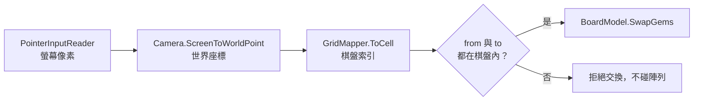
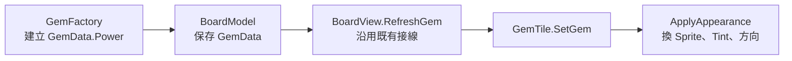
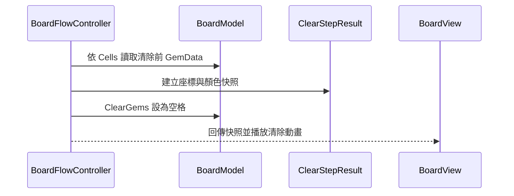
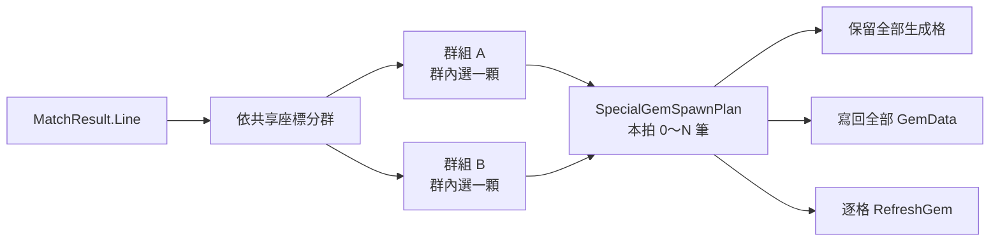
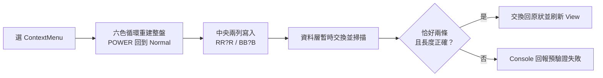

# MatchGems 現場課堂修正補充講稿

> 文件定位：本文件只服務 `CodingCatz/MatchGems` 現場教學 Repo 的除錯與補課。  
> 它不是原課程教材、不是 Lesson 01–20 的替代品，也不要求其他課程跟著同步。  
> 比對基準：`main` commit `774f1266e6ba39b7dda051cfbec83c7383735d7f`。  
> 驗證狀態：程式問題已完成靜態定位；本文 6 張 Mermaid 圖已實際渲染通過。Unity `6000.4.7f1` 的編譯與 Play Mode 行為仍待現場實機驗證。

## 這份補充課怎麼使用

這不是一次把所有程式換掉的修補清單，而是三段各約 45 分鐘的除錯課。每段維持同一個節奏：

1. 先用固定條件重現症狀。
2. 請學員預測資料應該怎麼流動。
3. 沿呼叫鏈找出第一個違反預期的位置。
4. 只修一個原因，立即重跑。
5. 留下可再次執行的回歸檢查。

每修完一項就建立一個小 commit。不要一次貼入整份終版程式，否則學員只會得到「新程式能跑」，卻不知道舊程式為什麼錯。

## 問題總覽與修正順序

| 順序 | 等級 | 問題 | 可觀察症狀 | 主要檔案 |
|---:|---|---|---|---|
| 1 | P1 | 世界座標轉格子時括號位置錯誤 | 格子尺寸不是 1 時，點擊與顯示對不上 | `GridMapper.cs` |
| 2 | P1 | 拖曳門檻混用世界單位與螢幕像素 | 滑鼠稍微移動就被當成拖曳 | `BoardInput.cs` |
| 3 | P1 | 第二次點擊使用舊的 `_targetCoord` | Click → Click 交換到 `(0,0)` 或上次拖曳位置 | `BoardInput.cs` |
| 4 | P1 | 交換只驗證 `to`，沒有驗證 `from` | 從棋盤外拖入時可能陣列越界 | `BoardFlowController.cs` |
| 5 | P1 | 初盤使用完全隨機填充 | 開局已有三消，無效交換也可能被接受 | `FillService.cs` |
| 6 | P1 | 清除後才讀取顏色 | `ClearedGemTypes` 永遠拿不到已清除寶石 | `BoardFlowController.cs` |
| 7 | P1 | 炸彈沒有驗證兩線真的相交 | 分離的橫線與直線也可能生出炸彈 | `BoardFlowController.cs` |
| 8 | P1 | 特殊線選擇被後面的短線覆蓋 | 五連可能輸給四連，與註解優先序不同 | `BoardFlowController.cs` |
| 9 | P1 | 一拍只能保存一筆特殊石生成結果 | 一次交換同時形成兩組四連，盤面只留下其中一顆 | Flow／Chain／Controller |
| 10 | P2 | 同方向直線石看起來分兩次消除 | 先消短線，再消同一排／列剩餘寶石 | Controller／View 時序 |
| 11 | P2 | 有洞時 `MatchFinder` 直接讀起點顏色 | 若在未補滿的棋盤掃描，可能讀到空格 | `MatchFinder.cs` |
| 12 | P2 | Pool 重設時只套用普通色 | 特殊石經物件池重用後可能失去特殊外觀 | `GemTile.cs` |
| 13 | P2 | 非同步流程沒有 `try/finally` 保底 | 動畫丟例外後可能永遠維持 Busy | `MatchGemsGameController.cs` |

## 階段性程式碼

### 本次增量

這份補充課不建立另一套專案；學員從 `774f126` 的現場程式繼續修改：

- **改既有**：`GridMapper`、`BoardInput`、`FillService`、`BoardFlowController`、`MatchFinder`。
- **改既有**：`GemTile`、`BoardView`、`MatchGemsGameController`。
- **新增一個 Runtime 類別**：`SpecialGemSpawnPlan`，專門保存同一拍 0～N 筆生成結果；單筆 `SpecialGemSpawnInfo` 繼續保留。
- **其餘新增方法**：`ApplyAppearance` 與三個外觀選擇方法、`FillInitial`、特殊線比較／分群方法、`DetonationPopAsync`、`AnimateDetonationAsync`。

### 本次實作順序

以下編號就是學員動手順序，不是問題嚴重度排序：

1. `GemTile → BoardView → GridMapper.ToCell`：先換實體圖、讓特殊石共用外觀入口並建立非 1 格尺寸，再讓 Cell 座標可信。
2. `BoardInput`：統一像素門檻並修正第二次點擊目標。
3. `BoardFlowController.TrySwap`：所有陣列操作前封住界外座標。
4. `FillService → BoardFlowController → GameController`：atomic 加入無既有三消初盤。
5. `BoardFlowController.ClearStep / DetonationStep`：清除前留下顏色快照。
6. `MatchFinder.ScanLine`：允許掃描暫時有洞的棋盤。
7. `GemTile.ResetGem`：Pool 重用時也走同一條完整外觀流程。
8. `TryFindBombSpawn + TryGetIntersection`：atomic 阻止假交叉炸彈。
9. `CreateSpecialGemSpawn + FindBestSpecialLine`：實作五連／T-L／四連優先序。
10. `SpecialGemSpawnPlan → Flow → Chain → Controller`：atomic 讓每個獨立配對群組各自生成一顆。
11. `GemTile → BoardView → GameController`：atomic 接上可辨識的引爆拍並修正回收時機。
12. `MatchGemsGameController.TrySwap`：最後用 `try/finally` 收住整條非同步流程。
13. 依固定盤面回歸表重跑；前一步沒過，不進下一步。

每一步下面都會再次寫明落點、取代範圍、呼叫端、原理、程式碼與立即驗證。標為 atomic 的步驟必須一次完成整組檔案，不能在中間狀態按 Play。

---

## 第一段：輸入座標不是同一種單位（約 45 分鐘）

### 本段目標

- 把程式產生的白方塊換成真正的中性寶石 Sprite，並讓圖像尺寸服從 CellWorldSize。
- 分清楚螢幕座標、世界座標與棋盤座標。
- 修正 `GridMapper.ToCell` 的運算順序。
- 讓 Click → Click 與 Drag 使用各自正確的目標座標。
- 在資料交換前封住棋盤外座標。

### 深層機制：座標轉換要維持單位一致

- **觸發時機**：玩家按下與放開滑鼠時，`BoardInput` 取得螢幕像素位置。
- **責任與接線**：Camera 把像素轉成世界位置；`GridMapper` 再把世界位置轉成 `CellCoord`；Flow 最後才驗證並交換資料。
- **資料與狀態流向**：Screen pixel → World unit → Cell index → `BoardModel` 陣列索引。
- **接錯症狀**：像素門檻拿世界尺寸比較會讓拖曳過度敏感；漏除格子尺寸會讓畫面位置與資料索引分離。
- **本段如何驗證**：分別使用 `CellWorldSize = 0.5 / 1 / 2` 點擊同一顆寶石，三種尺寸都必須得到正確格子。



### 修正 1：`GridMapper.ToCell` 的括號與負座標

這個修正不要只用白色方塊講。先把程式產生的預設方塊換成真正的寶石 Sprite，再刻意讓 `CellWorldSize` 不等於 1；圖片、世界尺寸與點擊格一旦不同步，原公式的錯誤會直接出現在畫面上。

#### ①-a `GemTile`／`BoardView`（改既有：換上實體寶石圖並依格子尺寸縮放）

- **前置素材**：準備一張透明背景、白色或灰階的正方形寶石 PNG。現場版本仍用 `SpriteRenderer.color` 表示六種 `GemType`，所以不要先放六張已上色圖片；彩色圖再乘色會失真。
- **精確落點**：`GemTile` 加入可由 Inspector 指定的 `_gemSprite`、格子尺寸設定與等比縮放；`BoardView` 在新建與 Pool 取出 Tile 時傳入 `CellWorldSize`。
- **誰呼叫**：`BoardView.CreateTileAt` 建立初盤 Tile；`AnimateFillAsync` 從 Pool 取出補珠 Tile。
- **原理**：Sprite 圖檔的像素與 PPU 只決定原始世界尺寸；棋盤 Cell 才是遊戲規則的尺寸來源。Tile 必須縮放去配合 Cell，不能反過來讓圖檔尺寸偷偷改變棋盤座標。

**Unity 圖片匯入設定**

1. 把 PNG 放進 `Assets/Art/Gems/`。
2. Inspector 將 `Texture Type` 設為 `Sprite (2D and UI)`。
3. `Sprite Mode` 使用 `Single`；像素風使用 `Point`，一般插畫使用 `Bilinear`。
4. 套用設定後，把 Sprite 拖到 GemTile Prefab 新增的 `Gem Sprite` 欄位。
5. 不要只拖到 `SpriteRenderer.Sprite`：目前 `SetGem` 會在執行時重新指定 Sprite，必須完成下面的程式接線。

`Assets/Scripts/View/GemTile.cs`：在 `_tileScale` 後新增欄位。`_tileScale` 從這一步開始代表「圖片占格子的比例」，`0.9` 就是保留 10% 格間距。

```csharp
[SerializeField]
private Sprite _gemSprite;

private float _cellWorldSize = 1f;
```

在 `#region 公開功能` 最前面新增：

```csharp
/// <summary>告訴 Tile 一格在世界座標中有多大。</summary>
public void ConfigureCellSize(float cellWorldSize)
{
    _cellWorldSize = Mathf.Max(0.01f, cellWorldSize);
    ApplyVisualScale();
}
```

完整取代 `SetGem`。這裡不再無條件呼叫 `GetDefaultSprite()`：有指定實體圖就用實體圖，沒有才使用白方塊備案。

```csharp
public void SetGem(GemData gemData)
{
    SpriteRenderer.sprite = GetDisplaySprite();
    SpriteRenderer.color = GetColor(gemData);
    ApplyVisualScale();
}
```

在 `#region 私有功能`、`GetDefaultSprite` 前新增：

```csharp
private Sprite GetDisplaySprite()
{
    return _gemSprite != null ? _gemSprite : GetDefaultSprite();
}

private void ApplyVisualScale()
{
    Sprite sprite = GetDisplaySprite();
    float sourceSize = Mathf.Max(
        sprite.bounds.size.x,
        sprite.bounds.size.y);

    if (sourceSize <= 0f)
    {
        return;
    }

    float targetSize = _cellWorldSize * _tileScale;
    float scale = targetSize / sourceSize;
    transform.localScale = Vector3.one * scale;
}
```

`Assets/Scripts/View/BoardView.cs`：完整取代 `CreateTileAt`，讓初盤建立的 Tile 取得格子尺寸。

```csharp
private GemTile CreateTileAt(Vector3 pos)
{
    GemTile tile = Instantiate(
        _tilePrefab,
        pos,
        Quaternion.identity,
        transform);

    tile.ConfigureCellSize(CellWorldSize);
    return tile;
}
```

同一檔案的 `AnimateFillAsync` 中，找到從 Pool 取出 Tile 的位置：

```csharp
GemTile tile = _tilePool.Get(
    SpawnAbove(board, fill.From),
    board.GetGem(fill.From));
```

緊接著加入：

```csharp
tile.ConfigureCellSize(CellWorldSize);
```

> ①-a 是 `GemTile`＋`BoardView` 的 atomic step。只改 `GemTile` 而沒有讓 Pool 取出的 Tile 重新取得 CellWorldSize，初盤看起來正常，第一次補珠卻可能忽然變回另一種尺寸。

**換圖後立即驗證**

- Prefab 有指定 Sprite：Play 後顯示實體寶石圖，不再被白方塊覆蓋。
- 暫時清空 `Gem Sprite`：仍能退回程式產生的白方塊，不出現 NullReference。
- 使用不同解析度與 PPU 的寶石圖：圖片仍占 Cell 的約 90%，不改變棋盤座標。
- 消除再補珠：Pool 取出的新珠尺寸與初盤一致。

#### ①-a-2 `GemTile`（改既有 Function：普通圖無痛轉成特殊石圖）

第一步只有一張中性寶石圖，顏色和特殊狀態仍靠 Tint 表現。若現場已準備普通、直線、炸彈、彩虹四種圖，不需要改 `GemData`、`GemFactory`、`BoardModel`、`BoardFlowController` 或 Controller；資料層已經用 `GemPower` 說清楚「它是什麼」，只要讓 View 的單一入口決定「它看起來像什麼」。



**為什麼這叫無痛轉移**

- 普通色、橫線、直線、炸彈、彩虹仍由既有 `GemData.Color + GemData.Power` 表示。
- 此階段的單筆 `ApplySpecialSpawn` 仍只改 Model；`RefreshGem` 仍只呼叫 `SetGem`。第三段修正 9 會把前者正式擴充成多筆 `ApplySpecialSpawns`，View 邊界不變。
- 只收斂 `GemTile` 內部 Function，不增加第二條特殊石更新路徑。
- 特殊圖使用白色／灰階模板，再由 `GemType` Tint 上色；六色不必乘上四種 Power 做成 24 張圖。

**素材與 Inspector 欄位**

準備四張同尺寸、相同 Pivot 的中性 Sprite：

| 欄位 | 圖片內容 | 備註 |
|---|---|---|
| `Gem Sprite` | 普通寶石 | ①-a 已建立 |
| `Line Sprite` | 水平條紋寶石 | 直向沿用同圖旋轉 90° |
| `Bomb Sprite` | 炸彈／爆裂紋寶石 | 仍用原 GemType 上色 |
| `Rainbow Sprite` | 彩虹特殊圖 | 可保持白色或使用自身彩色圖 |

`Assets/Scripts/View/GemTile.cs`：接在 `_gemSprite` 後新增三個欄位。

```csharp
[SerializeField]
private Sprite _lineSprite;

[SerializeField]
private Sprite _bombSprite;

[SerializeField]
private Sprite _rainbowSprite;
```

完整取代 ①-a 剛寫的 `SetGem`，讓所有外觀更新只走一支 Function：

```csharp
public void SetGem(GemData gemData)
{
    ApplyAppearance(gemData);
}
```

在 `#region 私有功能` 加入外觀總入口：

```csharp
private void ApplyAppearance(GemData gemData)
{
    SpriteRenderer.sprite = GetDisplaySprite(gemData);
    SpriteRenderer.color = GetDisplayTint(gemData);
    transform.localRotation = GetDisplayRotation(gemData);
    ApplyVisualScale();
}
```

接著用三個小 Function 各自回答「哪張圖、什麼顏色、什麼方向」。它們只負責 View，不改任何遊戲規則：

```csharp
private Sprite GetDisplaySprite(GemData gemData)
{
    Sprite normalSprite =
        _gemSprite != null ? _gemSprite : GetDefaultSprite();

    switch (gemData.Power)
    {
        case GemPower.HLine:
        case GemPower.VLine:
            return _lineSprite != null ? _lineSprite : normalSprite;

        case GemPower.Bomb:
            return _bombSprite != null ? _bombSprite : normalSprite;

        case GemPower.Rainbow:
            return _rainbowSprite != null ? _rainbowSprite : normalSprite;

        default:
            return normalSprite;
    }
}

private Color GetDisplayTint(GemData gemData)
{
    // Rainbow 圖若自帶彩色，必須用白色 Tint 才不會把原圖乘暗。
    if (gemData.Power == GemPower.Rainbow)
    {
        return Color.white;
    }

    return GetColor(gemData.Color);
}

private Quaternion GetDisplayRotation(GemData gemData)
{
    return gemData.Power == GemPower.VLine
        ? Quaternion.Euler(0f, 0f, 90f)
        : Quaternion.identity;
}
```

刪除舊的 `GetColor(GemData gemData)`。它原本用變亮程度區分 Line／Bomb；現在 Power 已由圖案形狀表達，只保留既有的 `GetColor(GemType gemType)` 做六色 Tint，避免同一個 Power 同時由兩套 Function 決定外觀。

最後修改 `ApplyVisualScale` 的 Sprite 來源。把：

```csharp
Sprite sprite = GetDisplaySprite();
```

改成：

```csharp
Sprite sprite = SpriteRenderer.sprite != null
    ? SpriteRenderer.sprite
    : (_gemSprite != null ? _gemSprite : GetDefaultSprite());
```

舊的無參數 `GetDisplaySprite()` 可以刪除；有參數版本已依 `GemData.Power` 選好 Sprite，再交給 `ApplyVisualScale` 讀目前 Renderer 上的正式結果。

> `Rainbow Sprite` 若也是白／灰階模板，可以把 `GetDisplayTint` 的 Rainbow 特判移除，讓它跟著 GemType 上色；本稿採「彩虹圖保留自身色彩」，所以回傳 `Color.white`。兩種都能用，但只能選一個規則，不能 Inspector 有時放彩色、有時放白圖卻期待同一段 Tint 自動猜中。

**特殊圖轉換立即驗證**

- `Normal`：顯示普通 Sprite，使用 GemType 色票。
- `HLine`：顯示 Line Sprite，角度 0°。
- `VLine`：沿用同一張 Line Sprite，角度 90°。
- `Bomb`：顯示 Bomb Sprite，仍使用原 GemType 色票。
- `Rainbow`：顯示 Rainbow Sprite，Tint 為白色，不把素材自身顏色乘暗。
- 把任一特殊 Sprite 欄位清空：退回普通 Sprite，程式不中斷。
- 呼叫既有 `BoardView.RefreshGem`：同一顆 Tile 必須原地從普通圖換成特殊圖，不建立新 Tile、不改 Pool 索引。

#### ①-b 用實體圖建立 `CellWorldSize != 1` 的除錯情境

在 `BoardView` Inspector 暫時設定：

```text
Cell Size     = 128
Pixel Per Unit = 64
CellWorldSize  = 128 / 64 = 2
```

此時一格寬 2 個 Unity 世界單位。若 Origin 位於世界 X=0，格子中心與邊界如下：

```text
格子編號        -1               0               1
世界邊界   -3──────────-1──────────1──────────3
格子中心        -2               0               2
```

拿四個位置請學員先預測，再讓程式印出結果：

| 世界位置 X | 正確 Cell X | 判斷理由 |
|---:|---:|---|
| `-1.1` | `-1` | 位於 Cell -1 的右半部 |
| `-0.9` | `0` | 已越過 -1 邊界 |
| `0.9` | `0` | 尚未越過 +1 邊界 |
| `1.1` | `1` | 已進入 Cell 1 |

錯誤公式會把格子尺寸在 `* 0.5 / cellSize` 中抵消，因此寶石圖雖然已按照 2 單位排開，點擊換算仍像每格只有 1 單位。這就是「換圖之後才突然點歪」的真正原因：圖片只是讓原本被 `CellWorldSize = 1` 掩蓋的公式錯誤現形。

#### ①-c `Assets/Scripts/Core/GridMapper.cs`（改既有：修正世界座標轉格子）

**目前症狀**

```csharp
int x = (int)(local.x + _cellWorldSize * 0.5f / _cellWorldSize);
```

乘除先於加法，實際計算接近 `local.x + 0.5f`，`_cellWorldSize` 沒有拿來縮放 `local.x`。此外，`(int)` 對負數朝零截斷，棋盤左下邊界容易被誤判到第 0 格。

**修正落點**

- **檔案與動作**：`Assets/Scripts/Core/GridMapper.cs`，完整取代 `ToCell(Vector3 worldPos)`。
- **誰呼叫**：`BoardInput.ScreenToCell`。
- **原理**：先把帶半格偏移的世界距離除以格子尺寸，再向下取整；不能先讓尺寸在乘除中自行抵消。

```csharp
public CellCoord ToCell(Vector3 worldPos)
{
    Vector3 local = worldPos - _origin;
    int x = Mathf.FloorToInt(
        (local.x + _cellWorldSize * 0.5f) / _cellWorldSize);
    int y = Mathf.FloorToInt(
        (local.y + _cellWorldSize * 0.5f) / _cellWorldSize);
    return new CellCoord(x, y);
}
```

**立即驗證**

- 保持 `CellWorldSize = 2`，依序點世界 X=`-1.1 / -0.9 / 0.9 / 1.1`，Log 必須得到 Cell X=`-1 / 0 / 0 / 1`。
- 點畫面上的第 `(3,2)` 顆實體寶石，Log 必須仍是 `(3,2)`；圖片大小不能影響索引結果。
- 點棋盤左邊界外一點，X 必須是負數，不能被截成 `0`。
- 驗證完成後可把 `Cell Size`／`Pixel Per Unit` 調回正式美術規格，但不准把它們調回剛好等於 1 當成修好。

### 修正 2：拖曳門檻統一使用螢幕像素

**目前症狀**

`_dragDelta` 來自兩個螢幕座標相減，單位是 pixel；`_dragThreshold = cellSize * 0.6f` 卻是世界尺寸。預設門檻約為 `0.6`，滑鼠移動一個像素就足以進入拖曳分支。

**修正落點**

- **檔案與動作**：`Assets/Scripts/Input/BoardInput.cs`，取代 `_dragThreshold` 欄位與 `Configure` 方法。
- **誰呼叫**：`MatchGemsGameController.ConfigureInput` 呼叫 `Configure`；`EndPointer` 讀取門檻。
- **原理**：`_dragDelta` 是螢幕像素，因此門檻也必須是螢幕像素。

```csharp
[SerializeField, Min(1f)]
private float _dragThreshold = 32f;

public void Configure(GridMapper gridMapper)
{
    _gridMapper = gridMapper;
    if (_camera == null) _camera = Camera.main;
}
```

這裡的 `32f` 是像素門檻。若未來要依解析度或 DPI 調整，應在輸入層統一換算，不能再次拿世界格尺寸直接比較。

**立即驗證**

- 按下後移動 5px 再放開：仍算點擊。
- 明顯往右拖超過 32px：只要求交換右邊相鄰格。

### 修正 3：Click → Click 要使用第二次點到的格子

**目前症狀**

第二次點擊呼叫 `_selectedCoord → _targetCoord`，但 `_targetCoord` 只在拖曳分支更新，所以它可能是預設 `(0,0)` 或上次拖曳留下的值。

**修正落點**

- **檔案與動作**：`Assets/Scripts/Input/BoardInput.cs`，完整取代 `EndPointer` 與 `SelectOrSwap`。
- **誰呼叫**：`Update` 在 Pointer Up 時呼叫 `EndPointer`；`EndPointer` 在點擊分支呼叫 `SelectOrSwap(clickedCoord)`。
- **原理**：拖曳目標是從方向推導，點擊目標則是第二次實際點到的格；兩條輸入路徑不能共用殘留欄位。

```csharp
private void EndPointer(Vector2 upPos)
{
    _isDragging = false;
    _dragDelta = upPos - _dragStartPos;

    if (_dragDelta.magnitude >= _dragThreshold)
    {
        CellCoord targetCoord = GetTargetCoord();
        SwapAction?.Invoke(_dragStartCoord, targetCoord);
        return;
    }

    CellCoord clickedCoord = ScreenToCell(upPos);
    SelectOrSwap(clickedCoord);
}

private void SelectOrSwap(CellCoord clickedCoord)
{
    if (!_hasSelected)
    {
        _hasSelected = true;
        _selectedCoord = clickedCoord;
        return;
    }

    _hasSelected = false;
    SwapAction?.Invoke(_selectedCoord, clickedCoord);
}
```

**立即驗證**

- 先點 `(2,2)`，再點 `(3,2)`，事件參數必須正好是這兩格。
- 做過一次拖曳後再使用兩次點擊，結果不能受上一次拖曳影響。

### 修正 4：交換前同時驗證 `from` 與 `to`

**目前症狀**

`TrySwap` 只檢查 `to`。若 `from` 在棋盤外但與 `to` 相鄰，後面的 `SwapGems` 仍可能直接索引界外陣列。

**修正落點**

- **檔案與動作**：`Assets/Scripts/Core/BoardFlowController.cs`，完整取代 `TrySwap`。
- **誰呼叫**：`MatchGemsGameController.TrySwap` 在任何動畫前先呼叫這個資料守門。
- **原理**：`BoardModel.SwapGems` 直接索引二維陣列，因此兩個座標都必須先通過 `IsInside`。

```csharp
public bool TrySwap(BoardModel board, CellCoord from, CellCoord to)
{
    if (State != BoardState.Idle ||
        !board.IsInside(from) ||
        !board.IsInside(to) ||
        !board.IsAdjacent(from, to))
    {
        return false;
    }

    State = BoardState.Swapping;
    board.SwapGems(from, to);
    return true;
}
```

### 第一段完成檢查

- [ ] `CellWorldSize = 0.5 / 1 / 2` 都能點到正確格子。
- [ ] 小幅移動仍是點擊，明顯拖曳才進交換。
- [ ] Click → Click 使用第二次點擊的格子，不依賴 `_targetCoord`。
- [ ] 棋盤外拖入與棋盤內拖出都只回傳 `false`，沒有例外。

---

## 第二段：棋盤資料要先保證正確，再交給畫面（約 45 分鐘）

### 本段目標

- 分開「初盤生成」與「消除後補珠」的規則。
- 在破壞資料前留下清除快照。
- 讓掃描器能安全面對暫時有洞的棋盤。
- 確保物件池重用後仍依完整 `GemData` 更新外觀。

### 深層機制：先拍快照，再破壞資料

- **觸發時機**：`ClearStep` 已算出要清的 Cells、但 `BoardModel` 尚未把格子設成空值時。
- **責任與接線**：Flow 負責建立 `ClearStepResult` 證據；Model 只負責改資料；Controller 和後續分數／目標系統只讀結果。
- **資料與狀態流向**：Cells → 讀取 GemData → 建立結果快照 → 清除 Model → View 播放動畫。
- **接錯症狀**：先清再讀會讓顏色清單為空；分數與任務看起來像偶發漏算，但根因是證據已被刪除。
- **本段如何驗證**：固定清除三顆指定顏色，清除後棋盤三格為空，但結果仍保留三筆正確顏色。



### 修正 5：初盤不能沿用完全隨機補珠

**目前症狀**

`FillService.Fill` 對所有空格完全隨機。初盤因此允許既有三消；之後玩家做一次本來無效的交換，`FindMatches` 掃描整盤時可能找到與交換無關的舊連線，使交換被接受。

**修正原則**

- 現場第 18 課已經示範到「先確認禁用色號」的方向；下面沿用這個半成品補成完整版本，不改回反覆亂數重抽。
- 初盤使用 `FillInitial`：先算出左方與下方會形成三連的「禁用色號」，再從其餘色號中抽一個。
- 消除後補珠保留 `Fill`：允許新珠形成天降連鎖，否則遊戲不會自然 combo。
- 不要把「禁止三消」塞進共用的 `CreateRandomGem`，因為初盤與補珠的需求不同。

#### ⑤-a `Assets/Scripts/Core/FillService.cs`（改既有：加入初盤專用填充）

- **精確落點**：保留原本的 `Fill(BoardModel board)`；在欄位區加入固定六色色票與可重用候選清單，在 `#region 公開方法` 加入 `FillInitial`，並用下面版本取代 `CreateRandomGem()`、加入三個禁用色號方法。
- **誰呼叫**：下一步的 `BoardFlowController.FillInitial`。
- **原理**：掃描順序固定為由下到上、由左到右，因此放置 `(x,y)` 時，左兩格與下兩格已經確定。若左兩格同色，就把該色號列為橫向禁用；下兩格同色，就列為縱向禁用。六色扣掉最多兩個禁用色後仍至少剩四個候選，所以不需要「抽錯就重抽 20 次」與可能放回錯色的 fallback。

先在 `FillService` 欄位區加入單一色票來源與候選清單：

```csharp
/// <summary>現場課程目前可產生的六種寶石；順序就是穩定色號。</summary>
public static IReadOnlyList<GemType> GemTypes { get; } =
    new GemType[]
    {
        GemType.Red,
        GemType.Blue,
        GemType.Green,
        GemType.Yellow,
        GemType.Purple,
        GemType.Pink
    };

private readonly List<int> _availableTypeIndexes = new List<int>();
```

`GemTypes` 的索引就是這段演算法使用的色號：Red 是 0、Blue 是 1……Pink 是 5。它也能取代後面固定測試盤面的 `TestGemTypes`，避免「初盤認為有六色，測試工具又手抄另一份六色」之後漂移。

加入 `#region 公開方法`：

```csharp
/// <summary>建立初盤：填滿空格，但不允許開局就存在三連。</summary>
public void FillInitial(BoardModel board)
{
    for (int y = 0; y < board.Height; y++)
    {
        for (int x = 0; x < board.Width; x++)
        {
            CellCoord target = new CellCoord(x, y);
            board.SetGem(target, PickInitialGem(board, target));
        }
    }
}
```

加入 `#region 私有方法`；若檔案尚無這個 region，就放在類別結尾前並補上區塊：

```csharp
private GemType PickInitialGem(BoardModel board, CellCoord target)
{
    int horizontalForbidden = GetForbiddenTypeIndex(
        board,
        new CellCoord(target.X - 1, target.Y),
        new CellCoord(target.X - 2, target.Y));
    int verticalForbidden = GetForbiddenTypeIndex(
        board,
        new CellCoord(target.X, target.Y - 1),
        new CellCoord(target.X, target.Y - 2));

    _availableTypeIndexes.Clear();

    for (int typeIndex = 0; typeIndex < GemTypes.Count; typeIndex++)
    {
        if (typeIndex != horizontalForbidden &&
            typeIndex != verticalForbidden)
        {
            _availableTypeIndexes.Add(typeIndex);
        }
    }

    int candidateListIndex =
        Random.Range(0, _availableTypeIndexes.Count);
    int selectedTypeIndex =
        _availableTypeIndexes[candidateListIndex];
    return GemTypes[selectedTypeIndex];
}

private int GetForbiddenTypeIndex(
    BoardModel board,
    CellCoord first,
    CellCoord second)
{
    if (!board.HasGem(first) || !board.HasGem(second))
    {
        return -1;
    }

    GemType firstType = board.GetGemColor(first);
    if (firstType != board.GetGemColor(second))
    {
        return -1;
    }

    return FindTypeIndex(firstType);
}

private int FindTypeIndex(GemType gemType)
{
    for (int typeIndex = 0; typeIndex < GemTypes.Count; typeIndex++)
    {
        if (GemTypes[typeIndex] == gemType)
        {
            return typeIndex;
        }
    }

    return -1;
}

private GemType CreateRandomGem()
{
    int typeIndex = Random.Range(0, GemTypes.Count);
    return GemTypes[typeIndex];
}
```

檔頭需要保留 `using System.Collections.Generic;` 與 `using Random = UnityEngine.Random;`。改成固定色票後不再需要用 `Enum.GetValues` 算數量；若 `using System;` 沒有其他用途，可以移除。

這裡的 `-1` 不是第負一種顏色，而是「這個方向沒有禁用色」的哨兵值。候選迴圈的合法色號只會是 `0` 到 `GemTypes.Count - 1`，因此永遠不會和 `-1` 撞號。

**立即驗證**

- 在 `PickInitialGem` 暫時印出 `horizontalForbidden`、`verticalForbidden` 與 `_availableTypeIndexes`；左右兩格都是 Red 時，候選中不得出現 0。
- 左兩格 Red、下兩格 Blue 時，候選只會從 2、3、4、5 抽取。
- 兩個方向禁止同一色時只排除一次，候選仍有另外五色。
- 不論亂數結果為何，都不需要重抽；方法一次必定從合法候選中回傳。

#### ⑤-b `Assets/Scripts/Core/BoardFlowController.cs`（改既有：公開初盤入口）

- **精確落點**：在目前的 `Fill(BoardModel board)` 前面新增方法；原 `Fill` 保留給消除後補珠。
- **誰呼叫**：`MatchGemsGameController.CreateBoard`。

```csharp
/// <summary>建立不含既有三連的初始盤面。</summary>
public void FillInitial(BoardModel board)
{
    _fillService.FillInitial(board);
}
```

#### ⑤-c `Assets/Scripts/Game/MatchGemsGameController.cs`（改既有：切換初盤呼叫）

- **精確落點**：在 `CreateBoard()` 內，只取代最後一行填充呼叫。
- **取代前**：`_boardFlowController.Fill(_boardModel);`
- **取代後**：

```csharp
private void CreateBoard()
{
    _boardModel = new BoardModel(_width, _height);
    _boardFlowController.FillInitial(_boardModel);
}
```

> ⑤-a～⑤-c 是一個 atomic step：三處都完成才按編譯。只改 Controller、還沒建立 `FillInitial` 時會得到 `CS1061`，那不是新 Bug，而是步驟尚未完成。

**固定盤面判準**

- 連續建立 100 張 8×8 初盤，每張初盤的 `FindMatches().HasMatch` 都必須是 `false`。
- 補珠仍允許形成配對，不能因修初盤而把天降連鎖一起消滅。

### 修正 6：`ClearStepResult` 必須在清除前蒐集

**目前症狀**

現場程式先執行 `board.ClearGems(coords)`，才呼叫 `ClearGemTypes(board, coords)`；這時 `board.HasGem(coord)` 已經全部是 `false`。

#### ⑥ `Assets/Scripts/Core/BoardFlowController.cs`（改既有：一次完成讀證據與清格）

- **精確落點**：完整取代 `ClearStep`、把 `DetonactionStep` 完整改名並取代成 `DetonationStep`；刪除舊的 `ClearGemTypes`，改放下面的 `ClearCoords`。
- **誰呼叫**：`MatchGemsGameController.TrySwap` 呼叫 `ClearStep`；`RunDetonationAsync` 呼叫 `DetonationStep`。
- **原理**：每一格都必須依序執行「還有寶石 → 讀顏色 → 清除」。若整批清完才回頭讀，證據已不存在。

完整取代 `ClearStep`：

```csharp
public ClearStepResult ClearStep(
    BoardModel board,
    MatchResult result,
    SpecialGemSpawnInfo spawnInfo,
    out DetonationChain chain)
{
    State = BoardState.Clearing;

    List<CellCoord> coords = result.GetUniqueCoords();
    RemoveSpawnCoord(coords, spawnInfo);

    // 必須在清格前登記：清掉之後讀不到特殊石的 Power。
    chain = _specialGemActivator.BeginChain(board, coords, spawnInfo);

    List<GemType> clearedGemTypes = new List<GemType>();
    ClearCoords(board, coords, clearedGemTypes);

    // 生成格已從 coords 排除，所以清完普通配對後再把特殊石放回去。
    ApplySpecialSpawn(board, spawnInfo);

    return new ClearStepResult(coords, clearedGemTypes);
}
```

完整取代並更名 `DetonactionStep`：

```csharp
public ClearStepResult DetonationStep(DetonationChain chain)
{
    State = BoardState.Clearing;

    List<CellCoord> coords = _specialGemActivator.ExpandNextLayer(chain);
    List<GemType> clearedGemTypes = new List<GemType>();
    ClearCoords(chain.Board, coords, clearedGemTypes);

    return new ClearStepResult(coords, clearedGemTypes);
}
```

刪除舊的 `ClearGemTypes`，在 `#region 私有方法` 加入：

```csharp
private static void ClearCoords(
    BoardModel board,
    IReadOnlyList<CellCoord> coords,
    List<GemType> clearedGemTypes)
{
    for (int i = 0; i < coords.Count; i++)
    {
        CellCoord coord = coords[i];

        if (!board.HasGem(coord))
        {
            continue;
        }

        clearedGemTypes.Add(board.GetGemColor(coord));
        board.ClearGem(coord);
    }
}
```

**立即驗證**

- 固定清除紅、藍、綠三顆；清除後三格 `HasGem == false`，結果仍依序保有三筆顏色。
- 搜尋全專案 `DetonactionStep`，修完這一步後只能剩文件中的舊名說明；C# 呼叫端要在第三段一併改成 `DetonationStep`。

### 防禦修正：掃描起點可能是空格

`MatchFinder.ScanLine` 第一行直接呼叫 `board.GetGemColor(start)`。目前主流程通常在補滿後才掃描，所以不一定立即觸發；但方法契約沒有保證永遠滿盤。

#### ⑪ `Assets/Scripts/Core/MatchFinder.cs`（改既有：讀顏色前先處理空格）

- **精確落點**：在 `ScanLine` 方法開頭、`GemType color = board.GetGemColor(start);` 之前插入。
- **誰呼叫**：`FindHorizontal` 與 `FindVertical`。
- **原理**：空格本身不是配對起點，但仍必須把掃描索引往下一格推進；只 `return` 原索引會讓 `while` 永遠停在同一格。

```csharp
if (!board.HasGem(start))
{
    CellCoord next = GetNextCoord(start, direction);
    return GetNextIndex(next, direction);
}
```

**立即驗證**：清空 `(2,2)` 後直接呼叫 `FindMatches`；沒有 NullReference，兩個方向的掃描都能越過空格並結束。

### 防禦修正：Pool 重設要使用同一條外觀流程

換圖以前，`SetGem` 與 `ResetGem` 分別呼叫不同的改色程式，已可能漏掉 Power；換成實體圖片後，如果 Pool 又自行指定 Sprite、Tint 或角度，同一顆特殊石還會在重用時變回普通圖。兩個入口都應收斂到 ①-a-2 的 `ApplyAppearance(gemData)`。

#### ⑫ `Assets/Scripts/View/GemTile.cs`（改既有：完整取代 `ResetGem`）

- **精確落點**：完整取代目前的 `ResetGem(Vector3 pos, GemData gemData)`。
- **誰呼叫**：`GemTilePool.Get` 每次取出舊 Tile 時呼叫。
- **原理**：Pool 內重用的是 View 物件，不是舊 GemData；每次 Get 都必須用新資料完整重設位置、縮放與 Power 外觀。

```csharp
public void ResetGem(Vector3 pos, GemData gemData)
{
    transform.position = pos;
    ApplyAppearance(gemData);
}
```

這裡不再個別呼叫 `GetDisplaySprite`、`GetDisplayTint`、`GetDisplayRotation` 或 `ApplyVisualScale`。`SetGem` 與 `ResetGem` 都只把完整 `GemData` 交給同一個外觀 Function；將來換第五種特殊圖時只改 `ApplyAppearance` 內部使用的小函式，不必改 Pool、BoardView 或 Controller。

**立即驗證**：同一個 Tile 先顯示普通紅石，Release 後用紅色 Bomb 資料 Get；它必須換成 Bomb Sprite、保留紅色 Tint、角度歸零，實體 Sprite 與 Cell 比例也保持不變。再用藍色 VLine 資料 Get，必須換成 Line Sprite、藍色 Tint 並旋轉 90°。

### 第二段完成檢查

- [ ] 100 張初盤都沒有既有三消。
- [ ] 消除後補珠仍可能產生天降配對。
- [ ] 清除資料已是空格時，`ClearStepResult` 仍保存清除前顏色。
- [ ] 在有洞棋盤呼叫 `FindMatches` 不會 NullReference，也不會卡迴圈。
- [ ] 特殊石經 Pool Release → Get → Reset 後仍保持正確 Sprite、Tint、方向與尺寸。

---

## 第三段：特殊石選擇、分層引爆與畫面節奏（約 45 分鐘）

### 本段目標

- 炸彈只在兩條線真的相交時生成。
- 五連、T/L、四連的優先序由程式實現，不只寫在註解。
- 分清楚「同一格重複清除」與「同一因果拆成兩個動畫拍」。
- 保留分層連鎖資料設計，同時改善直線石的視覺辨識。

### 修正 7：炸彈候選交叉點必須同時存在於兩條線

**目前症狀**

`TryGetIntersection` 只用直線的 X 與橫線的 Y 算出候選座標，沒有確認候選點真的被兩條 `MatchLine` 包含。兩條分離的同色線也可能生成炸彈，甚至覆蓋無關寶石。

#### ⑦ `Assets/Scripts/Core/BoardFlowController.cs`（改既有：呼叫端與交叉判斷一起取代）

- **精確落點**：完整取代 `TryFindBombSpawn` 與 `TryGetIntersection`。兩個方法是一個 atomic step，因為前者要接後者新的 `bool + out` 簽章。
- **誰呼叫**：`CreateSpecialGemSpawn` 在五連判定之後呼叫 `TryFindBombSpawn`。
- **原理**：用 X/Y 算出的只是候選點；只有兩條 `MatchLine` 都包含候選點，幾何上才真的形成 T/L。

完整取代 `TryFindBombSpawn`：

```csharp
private bool TryFindBombSpawn(
    MatchResult result,
    out SpecialGemSpawnInfo bombSpawn)
{
    bombSpawn = SpecialGemSpawnInfo.None;
    IReadOnlyList<MatchLine> lines = result.Line;

    for (int a = 0; a < lines.Count; a++)
    {
        for (int b = a + 1; b < lines.Count; b++)
        {
            MatchLine lineA = lines[a];
            MatchLine lineB = lines[b];

            if (lineA.Direction == lineB.Direction ||
                lineA.Color != lineB.Color)
            {
                continue;
            }

            if (!TryGetIntersection(lineA, lineB, out CellCoord intersection))
            {
                continue;
            }

            bombSpawn = new SpecialGemSpawnInfo(
                true,
                GemFactory.CreateBomb(lineA.Color),
                intersection);
            return true;
        }
    }

    return false;
}
```

完整取代 `TryGetIntersection`：

```csharp
private bool TryGetIntersection(
    MatchLine lineA,
    MatchLine lineB,
    out CellCoord intersection)
{
    MatchLine horizontal = lineA.Direction == MatchDirection.Horizontal
        ? lineA
        : lineB;
    MatchLine vertical = lineA.Direction == MatchDirection.Vertical
        ? lineA
        : lineB;

    CellCoord candidate = new CellCoord(
        vertical.CenterCoord.X,
        horizontal.CenterCoord.Y);

    if (horizontal.Contain(candidate) && vertical.Contain(candidate))
    {
        intersection = candidate;
        return true;
    }

    intersection = new CellCoord(0, 0);
    return false;
}
```

**立即驗證**

- 建立兩條同色但分離的橫／直 MatchLine：方法必須回傳 `false`。
- 建立真正共享一格的 T 型：回傳 `true`，而且 SpawnCoord 正是共享格。

### 修正 8：特殊線要比較優先序，不能讓最後一條獲勝

**目前症狀**

`FindSpecialLine` 每遇到一條長度至少 4 的線就覆寫 `line`，結果是「最後掃到的線獲勝」。稍早找到的五連可能被後面的四連蓋掉。

#### ⑧ `Assets/Scripts/Core/BoardFlowController.cs`（改既有：用具名比較取代最後一條獲勝）

- **精確落點**：完整取代 `CreateSpecialGemSpawn`、`FindSpecialLine` 與 `TryGetKeyGemCoord`；新增 `IsBetterSpecialLine`、`GetSpecialLineRank`。
- **誰呼叫**：公開的 `CreateSpawn` 沿用原接線，仍只呼叫 `CreateSpecialGemSpawn`。
- **原理**：優先序必須是可執行比較，不能只存在註解。先比較能力級別，再比較關鍵珠，最後才比較長度。

完整取代 `CreateSpecialGemSpawn`：

```csharp
private SpecialGemSpawnInfo CreateSpecialGemSpawn(
    MatchResult result,
    IReadOnlyList<CellCoord> moveCells)
{
    MatchLine bestLine = FindBestSpecialLine(
        result,
        moveCells,
        out CellCoord bestCoord);

    // 明確優先序：五連以上 > 真正的 T/L > 四連。
    if (bestLine != null && bestLine.Length >= 5)
    {
        return GemFactory.CreateSpawnInfo(
            bestLine.Color,
            bestLine.Length,
            bestLine.Direction,
            true,
            bestCoord);
    }

    if (TryFindBombSpawn(result, out SpecialGemSpawnInfo bombSpawn))
    {
        return bombSpawn;
    }

    if (bestLine != null)
    {
        return GemFactory.CreateSpawnInfo(
            bestLine.Color,
            bestLine.Length,
            bestLine.Direction,
            true,
            bestCoord);
    }

    return SpecialGemSpawnInfo.None;
}
```

刪除舊的 `FindSpecialLine`，改成：

```csharp
private MatchLine FindBestSpecialLine(
    MatchResult result,
    IReadOnlyList<CellCoord> moveCells,
    out CellCoord bestCoord)
{
    MatchLine bestLine = null;
    bool bestContainsKeyGem = false;
    bestCoord = new CellCoord(0, 0);

    for (int i = 0; i < result.LineCount; i++)
    {
        MatchLine candidate = result.Line[i];

        if (candidate.Length < 4)
        {
            continue;
        }

        bool containsKeyGem = TryGetKeyGemCoord(
            candidate,
            moveCells,
            out CellCoord candidateCoord);

        if (!IsBetterSpecialLine(
                candidate,
                containsKeyGem,
                bestLine,
                bestContainsKeyGem))
        {
            continue;
        }

        bestLine = candidate;
        bestContainsKeyGem = containsKeyGem;
        bestCoord = candidateCoord;
    }

    return bestLine;
}
```

把 `TryGetKeyGemCoord` 改成真的用回傳值表示有沒有找到 moved cell：

```csharp
private bool TryGetKeyGemCoord(
    MatchLine line,
    IReadOnlyList<CellCoord> moveCells,
    out CellCoord keyCoord)
{
    if (moveCells != null)
    {
        for (int i = 0; i < moveCells.Count; i++)
        {
            if (line.Contain(moveCells[i]))
            {
                keyCoord = moveCells[i];
                return true;
            }
        }
    }

    keyCoord = line.CenterCoord;
    return false;
}
```

加入兩個比較方法：

```csharp
private bool IsBetterSpecialLine(
    MatchLine candidate,
    bool candidateContainsKeyGem,
    MatchLine current,
    bool currentContainsKeyGem)
{
    if (current == null)
    {
        return true;
    }

    int candidateRank = GetSpecialLineRank(candidate);
    int currentRank = GetSpecialLineRank(current);

    if (candidateRank != currentRank)
    {
        return candidateRank > currentRank;
    }

    if (candidateContainsKeyGem != currentContainsKeyGem)
    {
        return candidateContainsKeyGem;
    }

    return candidate.Length > current.Length;
}

private int GetSpecialLineRank(MatchLine line)
{
    return line.Length >= 5 ? 2 : 1;
}
```

這裡刻意先比 Rank，再比關鍵珠：否則「含 moved cell 的四連」仍可能壓過「不含 moved cell 的五連」，又違反五連優先。

**立即驗證**

- 同一份 MatchResult 依序放入五連、四連，再反過來放；兩次都必須選五連。
- 兩條都是四連時，包含 moved cell 的那一條獲勝。
- 真正 T/L 與四連同時存在時，沒有五連才生成炸彈。

候選線至少依下列條件比較：

1. 五連以上優先於四連。
2. T/L 的真正交叉在獨立的炸彈判定中處理。
3. 同長度時，包含本次 moved cell 的線優先。
4. 仍相同時才使用穩定且可預測的掃描順序。

不要在找到第一條或最後一條時直接決定，應使用 `FindBestSpecialLine`／`IsBetterSpecialLine` 這類具名比較方法，讓優先規則可以單獨測試。

### 修正 9：一拍要保存每個獨立配對群組的生成結果

**目前症狀**

一次交換可能讓上下兩列同時形成四連，但 `CreateSpawn` 的回傳型別只有一個 `SpecialGemSpawnInfo`。程式即使掃到兩條合格線，最後仍只能交出一筆；後面的 `RemoveSpawnCoord`、`ApplySpecialSpawn`、`DetonationChain` 與 Controller 也全部只處理一格，因此第二顆在資料入口就已消失，不是單純漏掉 `RefreshGem`。

這裡要先分清楚兩種形狀：

- **共享任一座標的線**屬於同一群。T／L 的橫線與直線共享交點，所以群內依「彩虹 > 炸彈 > 直線」只選一顆。
- **完全不共享座標的線**屬於不同群。一次交換同時完成上下兩個四連時，兩群應各生一顆。



> ⑨-a～⑨-e 是同一個 atomic step。只改回傳型別會連續出現編譯錯誤；只改 Flow、不改 Chain 與 Controller，則會得到「Plan 算到兩顆，盤面或畫面只完成一顆」的半套結果。

#### ⑨-a `Assets/Scripts/Core/SpecialGemSpawnPlan.cs`（新增：本拍 0～N 筆生成計畫）

- **精確落點**：在 `Assets/Scripts/Core/` 新增整個檔案。
- **誰建立**：`BoardFlowController.CreateSpecialGemSpawnPlan`。
- **誰讀取**：`ClearStep`、`DetonationChain` 與 `MatchGemsGameController.TrySwap`。
- **原理**：`SpecialGemSpawnInfo` 繼續表示「一顆」；Plan 才表示「這一拍的全部」。不要把兩種責任塞進同一 struct。

```csharp
using System;
using System.Collections.Generic;

namespace MatchGems.Core
{
    /// <summary>同一拍所有特殊石生成結果。</summary>
    public sealed class SpecialGemSpawnPlan
    {
        private static readonly SpecialGemSpawnInfo[] EmptySpawns =
            Array.Empty<SpecialGemSpawnInfo>();

        private readonly SpecialGemSpawnInfo[] _spawns;

        public static SpecialGemSpawnPlan None { get; } =
            new SpecialGemSpawnPlan(EmptySpawns);

        public IReadOnlyList<SpecialGemSpawnInfo> Spawns => _spawns;
        public int Count => _spawns.Length;
        public bool HasSpawns => Count > 0;

        public SpecialGemSpawnPlan(
            IReadOnlyList<SpecialGemSpawnInfo> spawns)
        {
            _spawns = new SpecialGemSpawnInfo[spawns.Count];

            for (int i = 0; i < spawns.Count; i++)
            {
                _spawns[i] = spawns[i];
            }
        }

        public bool Contains(CellCoord coord)
        {
            for (int i = 0; i < _spawns.Length; i++)
            {
                CellCoord spawnCoord = _spawns[i].SpawnCoord;

                if (spawnCoord.X == coord.X && spawnCoord.Y == coord.Y)
                {
                    return true;
                }
            }

            return false;
        }
    }
}
```

**立即驗證**：先只建立 `SpecialGemSpawnPlan.None`，Console 印出的 `Count` 必須是 `0`、`HasSpawns` 必須是 `false`。

#### ⑨-b `Assets/Scripts/Core/BoardFlowController.cs`（改既有：先分群，再逐群選一顆）

- **精確落點**：用下面版本取代公開 `CreateSpawn`、私有 `CreateSpecialGemSpawn`、`FindBestSpecialLine` 與 `TryFindBombSpawn`；新增 `CreateSpawnForGroup`、`GroupConnectedLines`、`LinesShareCoord`。
- **誰呼叫**：Controller 改呼叫 `CreateSpawnPlan`。
- **原理**：外層分群決定「有幾次生成機會」；內層優先序只決定「這一群生成哪種」。若仍對整個 `MatchResult` 只跑一次最佳候選，第二個獨立群組必定被淘汰。

公開入口改成：

```csharp
public SpecialGemSpawnPlan CreateSpawnPlan(
    MatchResult result,
    IReadOnlyList<CellCoord> moveCells)
{
    return CreateSpecialGemSpawnPlan(result, moveCells);
}
```

新增整拍計畫與群內判定：

```csharp
private SpecialGemSpawnPlan CreateSpecialGemSpawnPlan(
    MatchResult result,
    IReadOnlyList<CellCoord> moveCells)
{
    List<List<MatchLine>> groups =
        GroupConnectedLines(result.Line);
    List<SpecialGemSpawnInfo> spawns =
        new List<SpecialGemSpawnInfo>();

    for (int i = 0; i < groups.Count; i++)
    {
        SpecialGemSpawnInfo spawn =
            CreateSpawnForGroup(groups[i], moveCells);

        if (spawn.HasSpecialGem)
        {
            spawns.Add(spawn);
        }
    }

    return spawns.Count == 0
        ? SpecialGemSpawnPlan.None
        : new SpecialGemSpawnPlan(spawns);
}

private SpecialGemSpawnInfo CreateSpawnForGroup(
    IReadOnlyList<MatchLine> lines,
    IReadOnlyList<CellCoord> moveCells)
{
    MatchLine bestLine = FindBestSpecialLine(
        lines,
        moveCells,
        out CellCoord bestCoord);

    if (bestLine != null && bestLine.Length >= 5)
    {
        return GemFactory.CreateSpawnInfo(
            bestLine.Color,
            bestLine.Length,
            bestLine.Direction,
            true,
            bestCoord);
    }

    if (TryFindBombSpawn(lines, out SpecialGemSpawnInfo bombSpawn))
    {
        return bombSpawn;
    }

    if (bestLine != null)
    {
        return GemFactory.CreateSpawnInfo(
            bestLine.Color,
            bestLine.Length,
            bestLine.Direction,
            true,
            bestCoord);
    }

    return SpecialGemSpawnInfo.None;
}
```

把第 8 項的 `FindBestSpecialLine` 第一個參數由 `MatchResult result` 改成 `IReadOnlyList<MatchLine> lines`，方法完整版本如下；`IsBetterSpecialLine`、`GetSpecialLineRank` 與 `TryGetKeyGemCoord` 保持第 8 項版本：

```csharp
private MatchLine FindBestSpecialLine(
    IReadOnlyList<MatchLine> lines,
    IReadOnlyList<CellCoord> moveCells,
    out CellCoord bestCoord)
{
    MatchLine bestLine = null;
    bool bestContainsKeyGem = false;
    bestCoord = new CellCoord(0, 0);

    for (int i = 0; i < lines.Count; i++)
    {
        MatchLine candidate = lines[i];

        if (candidate.Length < 4)
        {
            continue;
        }

        bool containsKeyGem = TryGetKeyGemCoord(
            candidate,
            moveCells,
            out CellCoord candidateCoord);

        if (!IsBetterSpecialLine(
                candidate,
                containsKeyGem,
                bestLine,
                bestContainsKeyGem))
        {
            continue;
        }

        bestLine = candidate;
        bestContainsKeyGem = containsKeyGem;
        bestCoord = candidateCoord;
    }

    return bestLine;
}
```

把第 7 項修好的 `TryFindBombSpawn` 改為接收單一群組；交點驗證仍沿用第 7 項的 `TryGetIntersection(..., out CellCoord)`：

```csharp
private bool TryFindBombSpawn(
    IReadOnlyList<MatchLine> lines,
    out SpecialGemSpawnInfo bombSpawn)
{
    bombSpawn = SpecialGemSpawnInfo.None;

    for (int a = 0; a < lines.Count; a++)
    {
        for (int b = a + 1; b < lines.Count; b++)
        {
            MatchLine lineA = lines[a];
            MatchLine lineB = lines[b];

            if (lineA.Direction == lineB.Direction ||
                lineA.Color != lineB.Color ||
                !TryGetIntersection(
                    lineA,
                    lineB,
                    out CellCoord intersection))
            {
                continue;
            }

            bombSpawn = new SpecialGemSpawnInfo(
                true,
                GemFactory.CreateBomb(lineA.Color),
                intersection);
            return true;
        }
    }

    return false;
}
```

新增共享座標分群：

```csharp
private List<List<MatchLine>> GroupConnectedLines(
    IReadOnlyList<MatchLine> lines)
{
    List<List<MatchLine>> groups =
        new List<List<MatchLine>>();
    bool[] assigned = new bool[lines.Count];

    for (int i = 0; i < lines.Count; i++)
    {
        if (assigned[i])
        {
            continue;
        }

        List<MatchLine> group =
            new List<MatchLine> { lines[i] };
        assigned[i] = true;

        for (int groupIndex = 0;
             groupIndex < group.Count;
             groupIndex++)
        {
            MatchLine current = group[groupIndex];

            for (int candidateIndex = 0;
                 candidateIndex < lines.Count;
                 candidateIndex++)
            {
                if (assigned[candidateIndex] ||
                    !LinesShareCoord(
                        current,
                        lines[candidateIndex]))
                {
                    continue;
                }

                assigned[candidateIndex] = true;
                group.Add(lines[candidateIndex]);
            }
        }

        groups.Add(group);
    }

    return groups;
}

private bool LinesShareCoord(MatchLine lineA, MatchLine lineB)
{
    for (int i = 0; i < lineA.Coords.Count; i++)
    {
        if (lineB.Contain(lineA.Coords[i]))
        {
            return true;
        }
    }

    return false;
}
```

**立即驗證**：以兩條互不共享座標的四連建立 `MatchResult`，`CreateSpawnPlan(...).Count` 必須為 `2`；再以共享交點的橫三＋直三建立 T 型，Count 必須為 `1`，且 Power 是 `Bomb`。

#### ⑨-c `BoardFlowController.cs`（改既有：保留並寫回全部生成格）

- **精確落點**：完整取代 `ClearStep`、`RemoveSpawnCoord`、`ApplySpecialSpawn`。
- **誰呼叫**：Controller 把上一小節取得的 Plan 傳入 `ClearStep`。
- **原理**：Plan 是多筆後，清除保護與資料寫回必須同時多筆化；任何一邊仍只處理第一筆都會留下半套盤面。

```csharp
public ClearStepResult ClearStep(
    BoardModel board,
    MatchResult result,
    SpecialGemSpawnPlan spawnPlan,
    out DetonationChain chain)
{
    State = BoardState.Clearing;
    List<CellCoord> coords = result.GetUniqueCoords();
    RemoveSpawnCoords(coords, spawnPlan);

    chain = _specialGemActivator.BeginChain(
        board,
        coords,
        spawnPlan);

    List<GemType> clearedGemTypes = new List<GemType>();
    ClearCoords(board, coords, clearedGemTypes);
    ApplySpecialSpawns(board, spawnPlan);

    return new ClearStepResult(coords, clearedGemTypes);
}

private void RemoveSpawnCoords(
    List<CellCoord> coords,
    SpecialGemSpawnPlan spawnPlan)
{
    for (int i = coords.Count - 1; i >= 0; i--)
    {
        if (spawnPlan.Contains(coords[i]))
        {
            coords.RemoveAt(i);
        }
    }
}

private void ApplySpecialSpawns(
    BoardModel board,
    SpecialGemSpawnPlan spawnPlan)
{
    for (int i = 0; i < spawnPlan.Spawns.Count; i++)
    {
        SpecialGemSpawnInfo spawn = spawnPlan.Spawns[i];
        board.SetGem(spawn.SpawnCoord, spawn.GemData);
    }
}
```

> 這裡直接沿用第 6 項的 `ClearCoords`，維持「讀顏色 → 清資料」的逐格順序。不要把已刪除的舊 `ClearGemTypes` 抄回來，也不要在 `ClearGems` 後才讀顏色。

#### ⑨-d `DetonationChain.cs`／`SpecialGemActivator.cs`（改既有：所有新生格先佔住 `_seen`）

- **精確落點**：完整取代 `DetonationChain` 建構式與 `SpecialGemActivator.BeginChain`。
- **誰呼叫**：`ClearStep` 呼叫 `BeginChain`；`BeginChain` 建立 Chain。
- **原理**：新生特殊石不應被同一拍的既有特殊石能力重新登記。若只把 Plan 第一格放進 `_seen`，第二顆仍可能生完立刻被炸掉。

`DetonationChain.cs`：

```csharp
public DetonationChain(
    BoardModel board,
    SpecialGemSpawnPlan spawnPlan)
{
    _board = board;

    for (int i = 0; i < spawnPlan.Spawns.Count; i++)
    {
        _seen.Add(ToKey(spawnPlan.Spawns[i].SpawnCoord));
    }
}
```

`SpecialGemActivator.cs`：

```csharp
public DetonationChain BeginChain(
    BoardModel board,
    IReadOnlyList<CellCoord> coords,
    SpecialGemSpawnPlan spawnPlan)
{
    DetonationChain chain =
        new DetonationChain(board, spawnPlan);

    for (int i = 0; i < coords.Count; i++)
    {
        chain.TryRegister(coords[i]);
    }

    return chain;
}
```

#### ⑨-e `Assets/Scripts/Game/MatchGemsGameController.cs`（改既有：逐筆刷新 View）

- **精確落點**：在 `TrySwap` 的 `while (result.HasMatch)` 內，取代建立 `spawnInfo`、呼叫 `ClearStep` 與單格 `RefreshGem` 的區段。收尾章節的完整 `TrySwap` 也必須使用同一版本。
- **誰呼叫**：交換主流程每個 combo 拍執行一次。
- **原理**：`ApplySpecialSpawns` 只改 Model；每一顆仍在原位的活 Tile 都要各自 `RefreshGem`，否則可能出現「資料有兩顆，畫面只看得出一顆」。

```csharp
SpecialGemSpawnPlan spawnPlan =
    _boardFlowController.CreateSpawnPlan(result, _moveCells);

ClearStepResult clearStepResult =
    _boardFlowController.ClearStep(
        _boardModel,
        result,
        spawnPlan,
        out DetonationChain chain);

comboCount++;

await _boardView.AnimateClearAsync(
    clearStepResult.ClearedCoords,
    _clearAnimationDuration);

for (int i = 0; i < spawnPlan.Spawns.Count; i++)
{
    _boardView.RefreshGem(
        _boardModel,
        spawnPlan.Spawns[i].SpawnCoord);
}
```

**雙生成固定盤型**

交換前把局部兩列設成：

```text
上列：R P R R
下列：P R P P
       ↑
交換 x=1 的上下兩顆
```

交換後應成為：

```text
上列：R R R R  → 一顆 HLine
下列：P P P P  → 一顆 HLine
```

**立即驗證**

- 交換前 `MatchResult.HasMatch == false`。
- 交換後 `spawnPlan.Count == 2`。
- `Spawns` 內同時包含上下兩個 moved cells，且 Power 都是 `HLine`。
- `ClearStep` 後兩個生成格都仍有 Gem，沒有被自己的配對拍清除。
- 動畫後兩個 Tile 都原地換成 Line 外觀；不能只看資料 Log。
- 再測 T／L：共享交點只生成一顆 Bomb，證明分群沒有把同一形狀拆成兩顆。

### 深層機制：同方向直線石為什麼看起來分兩次消除

- **觸發時機**：普通配對的清除清單中包含既有的橫消石或直消石。
- **責任與接線**：`ClearStep` 在清除前把特殊石登記成 Fuse；Controller 先播放普通配對，再呼叫 `DetonationStep` 展開特殊石範圍。
- **資料與狀態流向**：短配對 Cells → `_seen` 與 Fuse → 清短配對 → 展開整排／整列 → `_seen` 排除已清格 → 清剩餘格。
- **接錯症狀**：沒有 `_seen` 會重複清除甚至連鎖迴圈；兩拍都使用同一種 Pop 動畫時，正確的兩階段資料會被玩家誤認為重複處理。
- **本段如何驗證**：固定一顆 `VerticalLine` 在直向三消中，分別記錄兩拍座標；兩份清單交集必須為空，聯集必須等於短配對加整列能力範圍。


#### 這是 Bug 嗎？

分成兩拍是目前程式的明確設計，不是資料重複清除 Bug：

- 第一拍負責「玩家做出的普通配對」。
- 第二拍負責「被配對清掉的特殊石造成的效果」。
- `_seen` 讓短配對已清的格子不會再次進入第二拍。
- 同方向時兩個範圍高度重疊，所以最容易被看成「先消短的，再補消整條」。
- 垂直配對碰到橫消石時會形成十字，因果比較容易看懂，因此較少被誤認為異常。

真正需要修的是 View 回饋：兩拍目前都使用完全相同的 `AnimateClearAsync`，畫面沒有告訴玩家「第二拍是直線能力」。

#### 建議的畫面修正

先保留資料與連鎖分層，不要為了畫面直接把 `ClearStep` 和 `DetonationStep` 合併。以下是可直接接到目前 Repo 的最小版本：一般配對維持普通 Pop，引爆拍先變白再 Pop，讓玩家看得出第二拍來自特殊能力。

#### ⑩-a `Assets/Scripts/View/GemTile.cs`（改既有：加入引爆版 Pop）

- **精確落點**：在 `PopAsync` 後面新增 `DetonationPopAsync`。
- **誰呼叫**：下一步 `BoardView.AnimateDetonationAsync`。
- **原理**：先用最小視覺差異證明「這是能力拍」；橫向／直向掃光可等這個資料節奏驗收後再擴充。

```csharp
public async Task DetonationPopAsync(float duration)
{
    Color originalColor = SpriteRenderer.color;
    SpriteRenderer.color = Color.white;

    await PopAsync(duration);

    // Pool 下次 Get 前先還原；ResetGem 仍會再依 GemData 套正式外觀。
    SpriteRenderer.color = originalColor;
}
```

#### ⑩-b `Assets/Scripts/View/BoardView.cs`（改既有：動畫完成後才進 Pool）

- **精確落點**：完整取代 `AnimateClearAsync`；新增 `AnimateDetonationAsync`；刪除 `ReleaseeGemTile`，改成拼字正確的 `ReleaseGemTile`。
- **誰呼叫**：`TrySwap` 的一般配對呼叫 `AnimateClearAsync`；下一步 `RunDetonationAsync` 呼叫 `AnimateDetonationAsync`。
- **原理**：Tile 在動畫完成前不能先進可取用的 Pool。即使目前 Fill 發生在 await 之後，先回收仍破壞「池內物件目前可安全重用」的契約。

完整取代一般清除：

```csharp
public async Task AnimateClearAsync(
    IReadOnlyList<CellCoord> coords,
    float duration)
{
    List<Task> pops = new List<Task>();
    List<CellCoord> releaseCoords = new List<CellCoord>();

    for (int i = 0; i < coords.Count; i++)
    {
        GemTile tile = GetTile(coords[i]);

        if (tile == null)
        {
            continue;
        }

        pops.Add(tile.PopAsync(duration));
        releaseCoords.Add(coords[i]);
    }

    await Task.WhenAll(pops);

    for (int i = 0; i < releaseCoords.Count; i++)
    {
        ReleaseGemTile(releaseCoords[i]);
    }
}
```

在它後面新增引爆版清除：

```csharp
public async Task AnimateDetonationAsync(
    IReadOnlyList<CellCoord> coords,
    float duration)
{
    List<Task> pops = new List<Task>();
    List<CellCoord> releaseCoords = new List<CellCoord>();

    for (int i = 0; i < coords.Count; i++)
    {
        GemTile tile = GetTile(coords[i]);

        if (tile == null)
        {
            continue;
        }

        pops.Add(tile.DetonationPopAsync(duration));
        releaseCoords.Add(coords[i]);
    }

    await Task.WhenAll(pops);

    for (int i = 0; i < releaseCoords.Count; i++)
    {
        ReleaseGemTile(releaseCoords[i]);
    }
}
```

完整取代舊的 `ReleaseeGemTile`：

```csharp
private void ReleaseGemTile(CellCoord coord)
{
    GemTile tile = GetTile(coord);

    if (tile == null)
    {
        return;
    }

    _tilePool.Release(tile);
    _tiles[coord.X, coord.Y] = null;
}
```

#### ⑩-c `Assets/Scripts/Game/MatchGemsGameController.cs`（改既有：引爆拍改走專用 View API）

- **精確落點**：完整取代並更名 `RunDetonactionAsync`。
- **誰呼叫**：`TrySwap` 在普通配對動畫之後、重力之前 `await RunDetonationAsync(chain)`。

```csharp
private async Task RunDetonationAsync(DetonationChain chain)
{
    while (chain.HasFuses)
    {
        ClearStepResult result =
            _boardFlowController.DetonationStep(chain);

        if (result.ClearedCoords.Count == 0)
        {
            continue;
        }

        await _boardView.AnimateDetonationAsync(
            result.ClearedCoords,
            _clearAnimationDuration);
    }
}
```

最後把 `TrySwap` 裡的舊呼叫：

```csharp
await RunDetonactionAsync(chain);
```

改成：

```csharp
await RunDetonationAsync(chain);
```

> ⑩-a～⑩-c 是一個 atomic step：`GemTile`、`BoardView`、Controller 三處全部接完才編譯，否則會暫時出現找不到新方法的 `CS1061`。

完整演出順序現在是：

1. 普通配對縮小消失。
2. 特殊石位置短暫閃光或蓄力。
3. 橫消石播放橫向掃光；直消石播放直向掃光。
4. 掃光經過的剩餘寶石再 Pop。
5. 若掃到另一顆特殊石，再進下一層引爆拍。

這個最小版本只做到「引爆拍變白」，尚未畫真正的橫向／直向掃光。若現場沒有實作掃光，講稿與驗收只能宣稱「普通拍和能力拍可辨識」，不能宣稱方向特效已完成。

**立即驗證**

- 普通三消只播放原色縮小。
- 任何特殊石引爆時，第二拍先轉白再縮小。
- 在 `await Task.WhenAll` 前檢查 Pool，正在 Pop 的 Tile 不應已經排入可重用 Queue。
- 同方向直線石仍是兩拍，但第二拍不再像第二次普通三消。

### 固定盤面回歸表

| 固定案例 | 預期拍數 | 必須成立的資料判準 | 人眼觀察 |
|---|---:|---|---|
| 普通三消 | 1 | 沒有 Fuse | 只有普通 Pop |
| 橫配對包含橫消石 | 2 | 兩拍座標交集為空 | 短橫線後出現橫掃提示 |
| 直配對包含直消石 | 2 | 兩拍座標交集為空 | 短直線後出現直掃提示 |
| 橫配對包含直消石 | 2 | 聯集形成十字 | 第二拍方向清楚可辨 |
| 炸彈範圍包含直線石 | 3 以上 | 每顆特殊石只登記一次 | 一層一層炸，最後才落下 |
| 兩條分離的同色橫／直線 | 依各自配對 | 不得在假交叉點生成炸彈 | 無關寶石不被覆蓋 |
| 五連與四連同時成立 | 依設計 | 五連候選獲勝 | 生成結果與優先序一致 |
| 一次交換形成兩組獨立四連 | 1 個配對拍 | `SpawnPlan.Count == 2`，兩個生成格都保留 | 兩顆 Tile 都原地換成 Line 外觀 |
| 共享交點的 T／L | 1 個配對拍 | 同一群只產生 1 顆 Bomb | 交點原地換成 Bomb 外觀 |

### 第三段完成檢查

- [ ] 炸彈只在兩條 MatchLine 真正相交時生成。
- [ ] 五連不會被稍後掃到的四連覆蓋。
- [ ] 兩組獨立四連會得到兩筆 Spawn，T／L 共享群仍只得到一筆。
- [ ] Plan 內全部生成格都從清除清單排除、寫回 Model、預佔 `_seen` 並刷新 View。
- [ ] 同方向直線石的兩拍座標沒有重複。
- [ ] 學員能說明「資料沒有重複」與「畫面分兩拍」是兩件事。
- [ ] 特殊石連鎖全部完成後才套用重力與補珠。
- [ ] 第二拍至少有方向 Log／Debug Line；若已有正式演出，則橫掃與直掃可清楚辨識。

---

## 收尾修正：非同步流程必須保證回到可操作狀態

目前交換入口是非同步流程。若任一 View 動畫丟出例外，`SetIdle()` 可能永遠走不到，輸入會一直被 Busy 狀態擋住。

### ⑬ `Assets/Scripts/Game/MatchGemsGameController.cs`（改既有：完整取代 `TrySwap`）

- **精確落點**：完整取代目前的 `TrySwap(CellCoord from, CellCoord to)`；方法內的 `RunDetonactionAsync` 呼叫同步改成前一節建立的 `RunDetonationAsync`。
- **誰呼叫**：`ConfigureInput` 透過 `_boardInput.SwapAction = TrySwap` 接線。
- **原理**：只要 `TrySwap` 已成功把 State 改成 Swapping，後面所有 await 都必須由 `finally` 保證回到 Idle。無效交換與正常 combo 不再各自負責收尾。

```csharp
private async void TrySwap(CellCoord from, CellCoord to)
{
    if (!_boardFlowController.TrySwap(_boardModel, from, to))
    {
        return;
    }

    try
    {
        await _boardView.AnimateSwapAsync(
            from,
            to,
            _swapAnimationDuration);

        MatchResult result =
            _boardFlowController.FindMatches(_boardModel);

        if (!result.HasMatch)
        {
            _boardModel.SwapGems(from, to);
            await _boardView.AnimateSwapAsync(
                from,
                to,
                _swapAnimationDuration);
            return;
        }

        int comboCount = 0;
        _moveCells.Clear();
        _moveCells.Add(from);
        _moveCells.Add(to);

        while (result.HasMatch)
        {
            SpecialGemSpawnPlan spawnPlan =
                _boardFlowController.CreateSpawnPlan(result, _moveCells);

            ClearStepResult clearStepResult =
                _boardFlowController.ClearStep(
                    _boardModel,
                    result,
                    spawnPlan,
                    out DetonationChain chain);

            comboCount++;

            await _boardView.AnimateClearAsync(
                clearStepResult.ClearedCoords,
                _clearAnimationDuration);

            for (int i = 0; i < spawnPlan.Spawns.Count; i++)
            {
                _boardView.RefreshGem(
                    _boardModel,
                    spawnPlan.Spawns[i].SpawnCoord);
            }

            await RunDetonationAsync(chain);

            List<TileMove> falls =
                _boardFlowController.ApplyGravity(_boardModel);
            await _boardView.AnimateFallAsync(
                _boardModel,
                falls,
                _buildAnimationDuration);

            List<TileMove> fills =
                _boardFlowController.ApplyFill(_boardModel);
            await _boardView.AnimateFillAsync(
                _boardModel,
                fills,
                _buildAnimationDuration);

            result = _boardFlowController.FindMatches(_boardModel);
        }
    }
    finally
    {
        _boardFlowController.SetIdle();
    }
}
```

真正的 Unity 事件入口可以是 `async void`；拆出的內部流程必須回傳 `Task`，呼叫端才等得到，也才能測試與捕捉例外。

`comboCount` 目前只累加、尚未被其他系統使用；補充課保留它是為了不改變現場進度。若這個 Repo 不準備接計分，後續可另做清理，不要混在本次 Bug 修正裡。

**立即驗證**

- 無效交換回彈後 State 是 Idle。
- 正常 combo 全部落補後 State 是 Idle。
- 在任一動畫方法暫時 `throw new System.Exception("測試")`；Console 會收到例外，但下一次檢查 State 仍是 Idle。測完立刻移除故意丟錯。

前面的 ⑥ 與 ⑩-c 已經把 `DetonactionStep`／`RunDetonactionAsync` 統一改成 `DetonationStep`／`RunDetonationAsync`。這不是執行 Bug，但搜尋、講解與未來 API 使用都會被錯字持續污染；兩處必須同一個 atomic step 一起完成，避免半套更名造成編譯錯誤。

## 課堂除錯快捷：一步形成兩組四連／五連

現場已經有 `強制更新所有寶石變普通`，可以把整盤 `GemData.Power` 還原成 `Normal`；但若要重現「一次交換同時形成兩個獨立特殊石候選」，每次手動排 8 × 8 棋盤太慢，也很難確定排盤前沒有藏著其他三連。

這裡新增兩個 `ContextMenu`：

- `測試盤面/一步雙四連`
- `測試盤面/一步雙五連`

兩個快捷都先讀 `FillService.GemTypes`，用同一份六色色票循環重建整盤，因此舊 POWER 狀態會隨新的普通 `GemData` 一起清掉。接著只在中央兩列寫入測試形狀，最後由同一個 `MatchFinder` 做資料預驗證：交換前必須完全沒有配對；暫時交換中央上下兩格後，必須恰好得到兩條指定長度的橫線；驗證完立即換回，所以畫面仍停在「等待學員完成一步」的狀態。



### `Assets/Scripts/Game/MatchGemsGameController.cs`（改既有：新增固定盤面 ContextMenu）

- **精確落點**：不再在 Controller 手抄 `TestGemTypes`；直接讀修正 5 定義的 `FillService.GemTypes`。在類別結尾、最後一個 `}` 前加入兩個 ContextMenu 與三個私有方法。
- **誰呼叫**：講師在 Play Mode 對 `MatchGemsGameController` 元件開啟右鍵選單；兩個選單都只呼叫 `ArrangeDoubleLineMatchBoard`。
- **原理**：五連不是先排四顆同色再塞第五顆，而是排成 `RR?RR`；四連排成 `RR?R`。問號格與下一列互放對方需要的顏色，交換前沒有三連，交換後上下兩列同時完成。
- **狀態邊界**：未進 Play Mode、Board 尚未建立或 Flow 不在 `Idle` 時只警告、不改盤；測試快捷不碰 Pool、重力、消除或特殊石生成架構。

六色色票已由 `FillService.GemTypes` 定義；Controller 不新增第二份。於類別結尾加入完整方法：

```csharp
[ContextMenu("測試盤面/一步雙四連")]
private void ArrangeDoubleFourMatchBoard()
{
    ArrangeDoubleLineMatchBoard(4);
}

[ContextMenu("測試盤面/一步雙五連")]
private void ArrangeDoubleFiveMatchBoard()
{
    ArrangeDoubleLineMatchBoard(5);
}

private void ArrangeDoubleLineMatchBoard(int lineLength)
{
    if (_boardModel == null || _boardView == null)
    {
        Debug.LogWarning("請先進入 Play Mode，等棋盤建立後再使用測試盤面快捷。");
        return;
    }

    if (_isBusy)
    {
        Debug.LogWarning("棋盤流程仍在運作，請等 State 回到 Idle 再排測試盤面。");
        return;
    }

    if (_boardModel.Width < lineLength || _boardModel.Height < 2)
    {
        Debug.LogWarning($"一步雙{lineLength}連至少需要 {lineLength} × 2 的棋盤。");
        return;
    }

    FillTestPattern();

    int firstRow = Mathf.Max(0, _boardModel.Height / 2 - 1);
    int secondRow = firstRow + 1;
    int swapColumn = 2;

    for (int x = 0; x < lineLength; x++)
    {
        _boardModel.SetGem(x, firstRow, GemType.Red);
        _boardModel.SetGem(x, secondRow, GemType.Blue);
    }

    _boardModel.SetGem(swapColumn, firstRow, GemType.Blue);
    _boardModel.SetGem(swapColumn, secondRow, GemType.Red);

    if (lineLength < _boardModel.Width)
    {
        _boardModel.SetGem(lineLength, firstRow, GemType.Purple);
        _boardModel.SetGem(lineLength, secondRow, GemType.Yellow);
    }

    CellCoord from = new CellCoord(swapColumn, firstRow);
    CellCoord to = new CellCoord(swapColumn, secondRow);
    bool presetIsValid = ValidateDoubleLinePreset(from, to, lineLength);
    RefreshAllGems();

    string result = presetIsValid ? "通過" : "失敗，請檢查盤面生成規則";
    Debug.Log(
        $"一步雙{lineLength}連盤面已建立。交換 {from.pos} 與 {to.pos}；資料預驗證：{result}。");
}

private void FillTestPattern()
{
    for (int y = 0; y < _boardModel.Height; y++)
    {
        for (int x = 0; x < _boardModel.Width; x++)
        {
            int typeIndex =
                (x + y * 2) % FillService.GemTypes.Count;
            _boardModel.SetGem(
                x,
                y,
                FillService.GemTypes[typeIndex]);
        }
    }
}

private bool ValidateDoubleLinePreset(
    CellCoord from,
    CellCoord to,
    int expectedLength)
{
    MatchResult beforeSwap = _boardFlowController.FindMatches(_boardModel);
    if (beforeSwap.HasMatch)
    {
        return false;
    }

    _boardModel.SwapGems(from, to);
    MatchResult afterSwap = _boardFlowController.FindMatches(_boardModel);
    _boardModel.SwapGems(from, to);

    if (afterSwap.LineCount != 2)
    {
        return false;
    }

    for (int i = 0; i < afterSwap.LineCount; i++)
    {
        if (afterSwap.Line[i].Length != expectedLength)
        {
            return false;
        }
    }

    return true;
}
```

### 現場操作與立即驗證

1. 進入 Play Mode，等棋盤完全建立且沒有動畫。
2. 在 `MatchGemsGameController` 元件右鍵選 `測試盤面/一步雙四連`。
3. Console 必須顯示「資料預驗證：通過」。預設 8 × 8 棋盤交換 `(2,3)` 與 `(2,4)`。
4. 交換後 `MatchResult.LineCount` 應為 2，兩條 Length 都是 4；用它檢查同一拍是否留下兩顆 Line 特殊石。
5. 重新選 `測試盤面/一步雙五連`，交換同兩格；兩條 Length 都應為 5，可檢查同一拍是否留下兩顆 Rainbow。
6. 選一次既有的 `強制更新所有寶石變普通`，確認特殊石外觀可回到普通狀態；再重排固定盤面，舊 POWER 不得殘留。

> 這個快捷只證明「輸入盤面確實同時產生兩條獨立 MatchLine」。若交換後最後仍只留下單顆特殊石，證據就指向修正 9 的 SpawnPlan 單筆／多筆資料流，而不是講師排錯盤。

## 現場驗收紀錄模板

每次修正後複製一列填寫。沒有真正跑過 Unity 的項目只能寫「未驗證」。

| 日期 | Commit | Unity 版本 | 固定案例 | 資料斷言 | Play Mode | 人眼演出 | 結果／備註 |
|---|---|---|---|---|---|---|---|
| YYYY-MM-DD | `abcdef0` | `6000.x.xf1` | 例：直配對＋直消石 | 通過／失敗／未驗證 | 通過／失敗／未驗證 | 通過／失敗／未驗證 | 具體症狀 |

## 最終課堂判準

完成這份補充課，不是指「畫面看起來差不多」，而是能逐項回答：

- 輸入位置目前是哪一種單位？何時轉成下一種？
- 任何陣列索引之前，哪一層負責驗證界內？
- 初盤與補珠為什麼不能共用完全相同的選色規則？
- 為什麼清除證據一定要在改寫 BoardModel 前保存？
- 炸彈交叉點如何證明同時位於兩條 MatchLine？
- 為什麼 T／L 只生一顆，但兩組互不相交的四連要生兩顆？哪一層負責分群？
- 特殊石分兩拍時，哪些是資料事實，哪些只是 View 演出？
- `_seen` 防止的是什麼？移除後會看見什麼具體症狀？
- 為什麼所有引爆結束前不能先落下？

只要其中一題仍只能回答「因為程式就是這樣寫」，那個知識點就還沒有真正修完。
